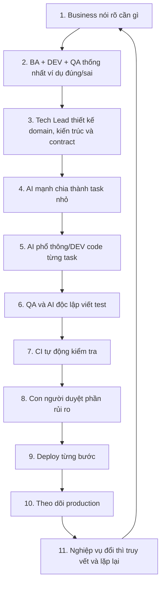

Tôi đã đọc toàn bộ file. Bản phản hồi trước **đúng về mặt chuyên môn**, nhưng nó viết theo kiểu dành cho Tech Lead/Architect đã quen nhiều khái niệm. Dưới đây tôi sẽ diễn giải lại như thể bạn mới bắt đầu, đồng thời giữ nguyên logic cốt lõi của tài liệu. 

# 1. Trước hết, hiểu ý tưởng lớn bằng một câu

Quy trình được đề xuất là:

> **Con người quyết định cần xây gì và thế nào là đúng. AI mạnh giúp phân tích, thiết kế và tìm rủi ro. AI phổ thông thực hiện những công việc nhỏ đã được mô tả rõ. Test và hệ thống kiểm tra tự động quyết định sản phẩm có đúng hay không.**

Hãy tưởng tượng bạn đang xây một tòa nhà:

* BA/PO xác định người dùng cần tòa nhà gì.
* Architect/Tech Lead thiết kế kết cấu.
* Các tài liệu kỹ thuật giống bản vẽ.
* AI coding agent giống đội thợ xây.
* Test giống đội kiểm định chất lượng.
* CI/CD giống dây chuyền tự động kiểm tra và đưa công trình vào sử dụng.
* Monitoring giống hệ thống cảm biến theo dõi tòa nhà sau khi vận hành.

Điểm quan trọng: **không được đưa cho AI một yêu cầu mơ hồ rồi hy vọng AI tự hiểu đúng**.

---

# 2. Tư duy ban đầu của bạn đúng ở đâu?

Bạn đang nghĩ:

1. BA dùng AI để làm rõ nghiệp vụ.
2. DEV và AI mạnh thiết kế hệ thống.
3. Thiết kế được chia nhỏ thành service, module, class, function.
4. AI phổ thông code từng phần nhỏ.
5. AI sinh test.
6. QA và BA kiểm tra test.
7. Khi nghiệp vụ đổi, AI tìm vùng ảnh hưởng.

Tư duy này **đúng phần lớn**.

Đặc biệt đúng ở ba điểm:

* Chất lượng phụ thuộc vào nghiệp vụ có rõ hay không, không phụ thuộc việc AI code nhanh đến đâu.
* AI mạnh nên xử lý những phần phức tạp, mơ hồ và có rủi ro lớn.
* AI phổ thông code rất tốt khi task nhỏ, input/output rõ và có test kiểm tra. 

## Nhưng có một điểm cần sửa

Không nên thiết kế trước toàn bộ:

```text
Service
→ Module
→ Class
→ File
→ Function
→ Từng dòng logic
```

cho cả hệ thống rồi mới bắt đầu code.

Vì khi nghiệp vụ thay đổi:

* hàng nghìn trang tài liệu có thể lỗi thời;
* code và tài liệu không còn khớp nhau;
* AI phải đọc quá nhiều;
* con người không thể review hết;
* dự án biến thành kiểu “thiết kế hết sáu tháng rồi mới code”.

Đây được gọi là **Waterfall**: làm tuần tự toàn bộ yêu cầu → thiết kế → code → test. Waterfall không phải lúc nào cũng xấu, nhưng với phần mềm thay đổi liên tục thì rất rủi ro.

Thay vào đó, chỉ nên đặc tả rất kỹ những thứ ổn định và quan trọng:

* nghiệp vụ;
* quy tắc;
* dữ liệu;
* API;
* event;
* input/output;
* điều kiện luôn phải đúng;
* tiêu chí kiểm thử;
* phạm vi task.

Cấu trúc class và function cụ thể có thể để DEV hoặc AI coding agent quyết định trong phạm vi được kiểm soát. 

---

# 3. Các thuật ngữ quan trọng nhất

Tài liệu đề xuất kết hợp:

```text
SDD
+ BDD/ATDD
+ Contract-First
+ TDD
+ Continuous Verification
+ DevSecOps/SRE
```

Nghe phức tạp, nhưng mỗi thứ trả lời một câu hỏi khác nhau.

## 3.1. SDD – Spec-Driven Development

**Spec** là bản đặc tả: mô tả rõ sản phẩm phải làm gì.

SDD nghĩa là:

> Viết và phê duyệt đặc tả trước, sau đó mới dùng đặc tả để thiết kế, chia task và code.

Ví dụ thay vì nói:

> Làm chức năng đặt lệnh chứng khoán.

Spec phải nói rõ:

```text
Ai được đặt lệnh?
Tài khoản phải ở trạng thái nào?
Nếu không đủ tiền thì sao?
Nếu thị trường đóng cửa thì sao?
Một request gửi hai lần có tạo hai lệnh không?
Lệnh có thể trải qua những trạng thái nào?
Đầu ra thành công là gì?
Mã lỗi thất bại là gì?
```

SDD giúp AI vì AI hoạt động tốt hơn khi được cung cấp tài liệu có cấu trúc rõ ràng. 

---

## 3.2. BDD – Behaviour-Driven Development

BDD tập trung vào **hành vi mà người dùng hoặc hệ thống nhìn thấy**.

Ví dụ:

```gherkin
Given tài khoản có 1.000 USD
When người dùng đặt lệnh cần 1.200 USD
Then hệ thống từ chối lệnh
And không giữ lại tiền
And trả mã lỗi INSUFFICIENT_BUYING_POWER
```

Giải thích:

* `Given`: điều kiện ban đầu.
* `When`: hành động xảy ra.
* `Then`: kết quả bắt buộc.
* `And`: các kết quả bổ sung.

BDD rất phù hợp để BA, DEV và QA nói cùng một ngôn ngữ.

BA không cần hiểu code sâu. DEV không cần tự đoán nghiệp vụ. QA biết chính xác phải kiểm tra điều gì.

## ATDD – Acceptance Test-Driven Development

ATDD gần với BDD, nhưng nhấn mạnh rằng:

> Trước khi code, team thống nhất các bài test dùng để chấp nhận tính năng.

**Acceptance test** là bài test trả lời:

> Tính năng này đã đủ đúng để business chấp nhận chưa?

BDD/ATDD không thay thế unit test. Nó nằm ở mức nghiệp vụ. 

---

## 3.3. Contract-First

**Contract** là hợp đồng giao tiếp giữa các thành phần.

Ví dụ Order Service gọi Balance Service:

```json
POST /balances/reserve

{
  "accountId": "A001",
  "amount": 1200,
  "currency": "USD",
  "idempotencyKey": "REQ-123"
}
```

Hai team phải thống nhất trước:

* URL là gì;
* field nào bắt buộc;
* kiểu dữ liệu;
* mã lỗi;
* timeout;
* có retry không;
* gửi lại request có bị trừ tiền hai lần không;
* version cũ và mới có tương thích không.

Đó chính là contract.

Một số công nghệ thường dùng:

* **OpenAPI**: mô tả REST API.
* **AsyncAPI**: mô tả message/event.
* **Protobuf**: mô tả dữ liệu cho gRPC.
* **Database schema**: cấu trúc bảng và dữ liệu.
* **Pact**: kiểm tra service gọi và service cung cấp có hiểu nhau giống nhau không. 

### Ví dụ dễ hiểu

Contract giống ổ cắm điện.

Bên cung cấp nói:

> Tôi cung cấp ổ điện 220V, chân cắm loại này.

Bên sử dụng phải làm phích cắm tương thích.

Nếu mỗi bên tự tưởng tượng một kiểu, đến lúc ghép vào mới phát hiện không cắm được.

---

## 3.4. TDD – Test-Driven Development

TDD là quy trình ở mức code:

```text
1. Viết test trước.
2. Chạy test và thấy thất bại.
3. Viết lượng code tối thiểu để test pass.
4. Làm sạch code.
5. Lặp lại.
```

Tại sao cố ý viết test thất bại trước?

Vì nếu test chưa từng thất bại, ta chưa chắc test có thực sự kiểm tra đúng thứ cần kiểm tra.

TDD thường dùng cho:

* function;
* class;
* thuật toán;
* domain logic;
* xử lý lỗi;
* các module nhỏ.

Mối quan hệ giữa các phương pháp:

* SDD: có đang xây đúng thứ cần xây không?
* BDD/ATDD: hành vi nghiệp vụ có đúng không?
* Contract test: các service có giao tiếp đúng không?
* TDD: code bên trong có hoạt động đúng không? 

---

## 3.5. Continuous Verification

Nghĩa là hệ thống liên tục kiểm tra chất lượng, không đợi đến cuối dự án.

Ví dụ mỗi lần DEV hoặc AI tạo Pull Request:

```text
Compile
→ Lint
→ Unit test
→ Contract test
→ Security scan
→ Compatibility check
→ Review
```

Nếu một bước fail thì không được merge.

---

## 3.6. DevSecOps

Có thể hiểu đơn giản:

> Dev, Security và Operations cùng tham gia trong toàn bộ vòng đời phát triển, thay vì đến cuối mới kiểm tra bảo mật và triển khai.

Ví dụ:

* kiểm tra secret từ lúc commit;
* kiểm tra thư viện có lỗ hổng;
* kiểm tra quyền truy cập;
* kiểm tra cấu hình deployment;
* không cho AI truy cập production credential.

---

## 3.7. SRE

SRE là **Site Reliability Engineering**.

Đây là cách tổ chức vận hành hệ thống dựa trên số liệu và kỹ thuật phần mềm.

SRE quan tâm:

* hệ thống có sẵn sàng không;
* có bị chậm không;
* có chịu được tải không;
* khi lỗi thì khôi phục thế nào;
* có cảnh báo không;
* có rollback được không.

---

# 4. Quy trình tổng thể hoạt động như thế nào?

Quy trình trong file gồm:

```text
Mục tiêu sản phẩm
→ Làm rõ nghiệp vụ
→ Viết đặc tả có thể kiểm chứng
→ Thiết kế domain và kiến trúc
→ Thiết kế contract và test
→ Chia task
→ AI/DEV code
→ Kiểm tra liên tục
→ Release
→ Theo dõi production
→ Nhận phản hồi và thay đổi
```

Điểm quan trọng: đây là một vòng lặp, không phải làm một lần rồi kết thúc. Mỗi feature nhỏ đều có thể đi qua vòng này. 

## Giải thích Mermaid

Trong Mermaid:

```text
flowchart LR
```

* `flowchart`: vẽ sơ đồ luồng.
* `LR`: Left to Right, từ trái sang phải.

```text
A --> B
```

nghĩa là A dẫn đến B.

```text
flowchart TD
```

nghĩa là từ trên xuống dưới: Top Down.

---

# 5. Giai đoạn 0 – Product Framing

Đây là bước xác định:

> Ta đang giải quyết vấn đề gì?

Không nên bắt đầu bằng:

> Sếp bảo làm một hệ thống trading.

Mà phải làm rõ:

* Người dùng là ai?
* Họ đang gặp vấn đề gì?
* Kết quả mong muốn là gì?
* Đo thành công bằng gì?
* Phiên bản đầu tiên làm đến đâu?
* Phần nào chưa làm?
* Rủi ro kinh doanh lớn nhất là gì?

## Ví dụ

Yêu cầu mơ hồ:

> Làm tính năng cảnh báo margin call.

Sau khi làm rõ:

```text
Người dùng:
Nhân viên risk và khách hàng margin.

Vấn đề:
Khách hàng không được cảnh báo đủ sớm khi tỷ lệ tài sản giảm.

Kết quả mong muốn:
Cảnh báo được gửi trong vòng 30 giây sau khi tài khoản vượt ngưỡng.

Phạm vi MVP:
Email và thông báo trong ứng dụng.

Chưa làm:
SMS và tự động liquidation.

Chỉ số thành công:
99% cảnh báo được gửi trong 30 giây.
```

## Các file được đề xuất

```text
product-brief.md
```

Mô tả sản phẩm và vấn đề.

```text
success-metrics.md
```

Mô tả cách đo thành công.

```text
scope.md
```

Làm gì và không làm gì.

```text
glossary.md
```

Từ điển thuật ngữ.

```text
assumptions.md
```

Những điều team đang tạm giả định.

```text
open-questions.md
```

Những câu hỏi chưa có câu trả lời.

AI có thể đọc các file này để tìm mâu thuẫn và câu hỏi còn thiếu, nhưng PO hoặc business owner phải là người phê duyệt cuối. 

---

# 6. Giai đoạn 1 – Business Discovery

Đây là giai đoạn tìm hiểu sâu về nghiệp vụ.

Tài liệu đề xuất mô hình **Three Amigos**, nghĩa là ba góc nhìn cùng trao đổi:

* BA/PO: hiểu business muốn gì.
* DEV/Architect: hiểu hệ thống có thể làm thế nào.
* QA: nghĩ xem hệ thống có thể sai ở đâu.

Không nhất thiết chính xác ba người. Ý nghĩa là ba vai trò phải cùng thảo luận.

## BA cần mô tả những gì?

BA không chỉ viết:

> Người dùng nhập lệnh và bấm Submit.

BA cần mô tả cả:

### Happy path

Đường đi bình thường.

```text
Đủ tiền
→ Thị trường mở
→ Lệnh hợp lệ
→ Lệnh được chấp nhận
```

### Alternative path

Đường đi khác nhưng vẫn hợp lệ.

```text
Lệnh chỉ khớp một phần
→ phần còn lại tiếp tục chờ
```

### Exception path

Tình huống lỗi.

```text
Balance Service timeout
→ không biết đã giữ tiền hay chưa
→ phải kiểm tra hoặc retry an toàn
```

### Boundary case

Trường hợp sát ranh giới.

```text
Có đúng 1.000 USD
Lệnh cần đúng 1.000 USD
Có được phép không?
Phí giao dịch tính trước hay sau?
```

### State transition

Sự chuyển trạng thái.

Ví dụ Order:

```text
Created
→ Validating
→ Accepted
→ Routed
→ PartiallyFilled
→ Filled
```

Hoặc:

```text
Validating
→ Rejected
```

**State machine** là mô hình mô tả:

* hệ thống có những trạng thái nào;
* được phép chuyển từ trạng thái nào sang trạng thái nào;
* điều kiện chuyển là gì.

Ví dụ không được phép:

```text
Rejected → Filled
```

vì một lệnh đã từ chối không thể tự nhiên khớp. 

---

## Decision table là gì?

Là bảng quyết định.

Ví dụ:

| Thị trường mở | Đủ tiền | Tài khoản active | Kết quả   |
| ------------- | ------- | ---------------- | --------- |
| Có            | Có      | Có               | Chấp nhận |
| Không         | Có      | Có               | Từ chối   |
| Có            | Không   | Có               | Từ chối   |
| Có            | Có      | Không            | Từ chối   |

Decision table giúp phát hiện trường hợp bị bỏ sót.

---

## Invariant là gì?

Invariant là điều **luôn luôn phải đúng**, bất kể hệ thống chạy theo đường nào.

Ví dụ:

```text
Số dư khả dụng không được âm.
Một khoản tiền không được giữ hai lần.
Một order không được khớp nhiều hơn khối lượng ban đầu.
Tổng debit phải bằng tổng credit trong double-entry ledger.
```

Invariant cực kỳ quan trọng trong hệ thống tài chính.

Test bình thường kiểm tra một vài ví dụ. Invariant kiểm tra nguyên tắc nền tảng của hệ thống.

---

## Concurrency là gì?

Concurrency là nhiều thao tác xảy ra gần như cùng lúc.

Ví dụ tài khoản có 1.000 USD:

```text
Request A muốn giữ 800 USD
Request B muốn giữ 800 USD
```

Cả hai đến cùng lúc.

Nếu hệ thống xử lý sai, cả hai đều thấy tài khoản có 1.000 USD và cùng giữ thành công, khiến tổng số tiền được dùng là 1.600 USD.

Đây là lỗi concurrency.

---

## Retry, timeout, duplicate là gì?

### Timeout

Service A gọi Service B nhưng chờ quá lâu không nhận được phản hồi.

### Retry

Service A thử gọi lại.

### Duplicate

Cùng một yêu cầu bị gửi nhiều lần.

Vấn đề nguy hiểm:

```text
Service A gửi yêu cầu giữ tiền.
Balance Service đã giữ tiền thành công.
Phản hồi bị mất.
Service A timeout và gửi lại.
Balance Service giữ tiền lần hai.
```

Vì vậy cần **idempotency**.

---

## Idempotency là gì?

Một thao tác idempotent nghĩa là:

> Gửi lại cùng một yêu cầu nhiều lần vẫn chỉ tạo ra một kết quả nghiệp vụ.

Ví dụ cùng `idempotencyKey = ABC123`:

```text
Lần 1: tạo order ORD-001.
Lần 2: trả lại ORD-001.
Lần 3: vẫn trả ORD-001.
```

Không tạo ORD-002 và ORD-003.

---

## AI không được tự điền requirement

AI phải phân chia kết quả thành:

```text
Thông tin đã xác nhận
Quyết định rõ ràng
Giả định cần xác nhận
Mâu thuẫn
Câu hỏi chưa trả lời
Edge case còn thiếu
```

AI không được âm thầm quyết định:

> Tôi nghĩ trường hợp này nên tự động retry ba lần.

Nếu business hoặc technical owner chưa quyết định, AI phải ghi đó là assumption hoặc open question. 

---

# 7. Giai đoạn 2 – Executable Feature Specification

**Executable specification** không nhất thiết có nghĩa toàn bộ tài liệu tự chạy được.

Nó có nghĩa:

> Tài liệu được viết rõ đến mức có thể chuyển thành test tự động và máy có thể kiểm tra kết quả.

Mỗi feature có thể có thư mục riêng:

```text
specs/features/ORD-001-place-order/
```

Trong đó:

```text
requirements.md
```

Tính năng cần làm gì.

```text
business-rules.md
```

Các quy tắc nghiệp vụ.

```text
examples.feature
```

Ví dụ BDD/Gherkin.

```text
decision-table.md
```

Bảng các điều kiện và kết quả.

```text
state-machine.md
```

Các trạng thái và chuyển trạng thái.

```text
nfr.md
```

Yêu cầu phi chức năng.

```text
assumptions.md
```

Các giả định chưa xác nhận.

```text
trace.yaml
```

Liên kết feature với rule, API, test, task và code. 

---

## NFR là gì?

NFR là **Non-Functional Requirement**, yêu cầu phi chức năng.

Functional requirement:

> Người dùng có thể đặt lệnh.

NFR:

```text
95% request phải hoàn thành dưới 200 ms.
Hệ thống chịu được 5.000 request/giây.
Dữ liệu phải mã hóa.
Hệ thống đạt 99,99% availability.
Audit log lưu trong bảy năm.
```

NFR mô tả **hệ thống phải tốt đến mức nào**, không chỉ làm được chức năng gì.

---

## Spec Ready nghĩa là gì?

Một feature chỉ được chuyển sang thiết kế/code khi:

* mục tiêu rõ;
* phạm vi rõ;
* quy tắc nghiệp vụ có mã định danh;
* có ví dụ thành công, thất bại và sát biên;
* không còn câu hỏi khiến DEV không thể triển khai;
* kết quả có thể kiểm tra;
* có NFR cần thiết;
* có người chịu trách nhiệm phê duyệt.

Ví dụ yêu cầu này chưa ready:

> Hệ thống phải xử lý nhanh.

“Nhân” là bao nhiêu?

Nên sửa thành:

> 99% yêu cầu đặt lệnh phải trả kết quả trong 300 ms, không tính thời gian phản hồi của sàn.


---

# 8. Giai đoạn 3 – Domain và kiến trúc

## Domain là gì?

Domain là lĩnh vực nghiệp vụ mà hệ thống giải quyết.

Trong chứng khoán có thể có:

* Customer/KYC;
* Account;
* Order;
* Execution;
* Position;
* Cash;
* Risk;
* Settlement;
* Corporate Action;
* Reporting.

Mỗi domain có ngôn ngữ và quy tắc riêng.

---

## Business capability là gì?

Business capability là một khả năng nghiệp vụ mà công ty cần có.

Ví dụ:

```text
Quản lý khách hàng
Quản lý tài khoản
Nhận và kiểm tra lệnh
Định tuyến lệnh
Quản lý số dư
Tính vị thế
Đối soát
Thanh toán bù trừ
```

Capability trả lời:

> Doanh nghiệp cần có khả năng làm gì?

---

## Bounded Context là gì?

Đây là một ranh giới trong đó các thuật ngữ và quy tắc có ý nghĩa nhất quán.

Ví dụ từ `Account` có thể mang nghĩa khác nhau:

* Customer Domain: tài khoản đăng nhập.
* Trading Domain: tài khoản giao dịch.
* Ledger Domain: tài khoản kế toán.
* Bank Integration: tài khoản ngân hàng.

Nếu dùng chung một class `Account` cho tất cả, hệ thống sẽ rất hỗn loạn.

Vì vậy chia thành các bounded context:

```text
Identity Context
Trading Account Context
Ledger Context
Banking Context
```

Mỗi context sở hữu mô hình của mình.

---

## C4 là gì?

C4 là cách vẽ kiến trúc theo nhiều mức:

### Context

Hệ thống tương tác với ai và hệ thống bên ngoài nào.

```text
Khách hàng
Broker System
Exchange
Bank
Regulator
```

### Container

Các khối lớn có thể chạy/deploy.

Ví dụ:

```text
Web App
API Gateway
Order Service
Risk Service
Database
Kafka
```

Ở đây `Container` không nhất thiết là Docker container. Trong C4, nó là một ứng dụng hoặc kho dữ liệu chạy độc lập.

### Component

Các thành phần bên trong một service.

Ví dụ trong Order Service:

```text
Place Order Handler
Validation Component
Routing Adapter
Order Repository
```

### Code

Class và function.

Trong thực tế, phần lớn team chỉ cần Context và Container. Không cần vẽ mọi class của cả hệ thống. 

---

## ADR là gì?

ADR là **Architecture Decision Record**.

Đây là tài liệu ghi lại một quyết định kiến trúc.

Ví dụ:

```text
ADR-023: Sử dụng Kafka cho Order Event

Bối cảnh:
Reporting và Notification cần nhận Order Event.

Quyết định:
Order Service publish event vào Kafka.

Lý do:
Các consumer có thể xử lý độc lập.

Nhược điểm:
Tăng độ phức tạp vận hành và eventual consistency.

Phương án đã cân nhắc:
REST callback, database polling.

Ngày quyết định:
...

Người phê duyệt:
...
```

ADR giúp sau này biết:

> Tại sao team lại làm như vậy?

Nếu không có ADR, sáu tháng sau người mới nhìn vào sẽ tưởng thiết kế là ngẫu nhiên.

---

## Failure mode là gì?

Failure mode là cách một thành phần có thể hỏng.

Ví dụ Balance Service:

* timeout;
* trả dữ liệu cũ;
* xử lý thành công nhưng response bị mất;
* database unavailable;
* nhận request trùng;
* xử lý chậm;
* chỉ ghi được một phần dữ liệu.

Thiết kế tốt không chỉ mô tả happy path. Nó phải mô tả hệ thống phản ứng thế nào khi dependency lỗi.

---

# 9. Service, module, package, namespace, class, function

Cấu trúc tổng quát:

```text
Software System
└── Service / Deployable
    └── Module / Package / Project
        └── Class / Component
            └── Method / Function
```


## Software System

Toàn bộ sản phẩm hoặc hệ thống.

Ví dụ:

```text
One-WalleX Trading Platform
```

## Service

Một ứng dụng hoặc tiến trình có trách nhiệm tương đối độc lập và thường có thể deploy riêng.

Ví dụ:

```text
Order Service
Balance Service
Risk Service
```

## Deployable

Bất kỳ đơn vị nào có thể build và triển khai độc lập.

Một deployable có thể là:

* service;
* worker;
* scheduled job;
* frontend app.

## Module

Một khối logic bên trong service.

Ví dụ Order Service:

```text
order-domain
order-application
order-infrastructure
order-api
```

## Package

Cách nhóm các class/file có liên quan.

Java:

```text
com.company.order.domain
com.company.order.application
```

## Namespace

Namespace chủ yếu giúp tránh trùng tên.

Ví dụ .NET:

```csharp
Company.Order.Domain
Company.Balance.Domain
```

Cả hai đều có thể có class `Account`, nhưng không bị xung đột vì namespace khác nhau.

Namespace không tự động có nghĩa là kiến trúc đã tách tốt.

## Class

Một kiểu đối tượng có dữ liệu và hành vi.

```java
class Order {
    OrderStatus status;
    void cancel() {}
}
```

## Method / Function

Một hành động nhỏ.

```text
calculateRequiredAmount()
validateBuyingPower()
reserveFunds()
```

### Cách bạn gọi “module/namespace con phía trong service” có đúng không?

Ý của bạn đúng, nhưng từ chính xác tùy công nghệ:

* Java: module → package → class → method.
* .NET: project/assembly → namespace → class → method.
* TypeScript: package/module → folder/file → class/function.
* Go: module → package → file → function/type.

---

# 10. Chia service như thế nào?

Không nên chia service vì:

* có nhiều developer;
* có nhiều class;
* mỗi feature thành một service;
* mỗi bảng database thành một service;
* AI có thể code riêng phần đó.

Nên xem xét:

* service đại diện cho capability nghiệp vụ nào;
* sở hữu dữ liệu gì;
* có cần deploy độc lập không;
* có cần scale riêng không;
* có yêu cầu availability riêng không;
* thay đổi có cùng nhịp không;
* có transaction chặt chẽ với nhau không.

Ví dụ không nên tách quá sớm:

```text
CreateOrderService
CancelOrderService
ModifyOrderService
QueryOrderService
```

Có thể ban đầu chỉ cần:

```text
Order Service
```

bên trong có các module tương ứng.

AI làm code rẻ hơn nhưng không làm các vấn đề này biến mất:

* network timeout;
* distributed transaction;
* deployment;
* monitoring;
* version compatibility;
* incident management.

Vì vậy không nên chia microservice quá sớm. 

---

# 11. Model mạnh cần làm gì trong kiến trúc?

Model mạnh không nên chỉ trả về một phương án.

Nó nên đưa ra:

```text
Phương án A
Ưu điểm
Nhược điểm
Rủi ro
Khi nào phù hợp

Phương án B
Ưu điểm
Nhược điểm
Rủi ro
Khi nào phù hợp
```

Ngoài ra phải phân tích:

* consistency;
* transaction;
* concurrency;
* security;
* migration;
* rollback;
* failure mode;
* NFR;
* chi phí vận hành.

Nhưng Tech Lead/Architect mới là người ra quyết định và phê duyệt ADR. 

---

# 12. Giai đoạn 4 – Contract và test trước khi code

Giả sử có luồng:

```text
Frontend
→ Order Service
→ Risk Service
→ Balance Service
→ Kafka
→ Reporting Service
```

Trước khi các team code song song, phải thống nhất contract.

Ví dụ Order Service gọi Balance Service:

```text
Input:
accountId
amount
currency
idempotencyKey

Output thành công:
reservationId
reservedAmount
status

Lỗi:
INSUFFICIENT_BALANCE
ACCOUNT_BLOCKED
TIMEOUT
DUPLICATE_REQUEST
```

Ngoài schema, còn phải thống nhất:

* timeout bao lâu;
* retry mấy lần;
* lỗi nào được retry;
* xác thực thế nào;
* có quyền gọi không;
* event có thể trùng không;
* event có đúng thứ tự không;
* version cũ có còn được hỗ trợ không.


---

# 13. Mock, Stub, Integration và E2E khác nhau thế nào?

## Mock

Đối tượng giả do test điều khiển.

Ví dụ:

```text
Khi gọi BalanceClient.reserve()
hãy giả vờ trả về Success.
```

Dùng cho unit test, rất nhanh.

Nhược điểm: mock có thể không giống service thật.

---

## Stub

Một phiên bản giả có hành vi được định nghĩa sẵn.

Ví dụ fake Balance Service chạy HTTP:

```text
POST /reserve
→ trả JSON theo OpenAPI
```

## Contract-verified stub

Stub được sinh hoặc kiểm tra dựa trên contract thật.

Như vậy ít nguy cơ fake API trả cấu trúc khác production.

---

## Ephemeral real dependency

Chạy dependency thật nhưng tạm thời.

Ví dụ dùng container để chạy:

* PostgreSQL thật;
* Kafka thật;
* Redis thật.

Test xong thì xóa.

---

## Full environment / E2E

Chạy nhiều service thật cùng nhau và kiểm tra luồng từ đầu đến cuối.

Ví dụ:

```text
Đăng nhập
→ đặt lệnh
→ kiểm tra tiền
→ tạo order
→ nhận event
→ hiển thị trên UI
```

E2E chậm, dễ không ổn định và khó tìm nguyên nhân lỗi. Vì vậy chỉ nên giữ một số luồng quan trọng.

Không nên mock toàn bộ hệ thống rồi gọi đó là integration test. 

---

# 14. Giai đoạn 5 – Task Graph

Sau khi có spec và thiết kế, AI mạnh chia feature thành các task nhỏ.

Ví dụ:

```text
T1: Định nghĩa API
T2: Tạo domain model
T3: Viết validation
T4: Tạo Balance adapter
T5: Viết luồng điều phối đặt lệnh
T6: Publish event
T7: Component test
T8: Contract test
T9: Acceptance test
```

Nhưng các task có phụ thuộc:

```text
Không thể làm T5 trước khi biết T2, T3, T4.
```

Task graph là sơ đồ thể hiện:

* task nào làm trước;
* task nào làm song song;
* task nào phụ thuộc task nào.


---

# 15. Task Packet là gì?

Task packet là gói hướng dẫn đầy đủ cho một DEV hoặc coding agent.

Một task tốt phải có:

## Goal

Mục tiêu.

```text
Triển khai luồng điều phối đặt lệnh cash equity.
```

## In scope

Các file hoặc khu vực được phép sửa.

```text
services/order/src/application/place-order/*
```

## Out of scope

Không được làm gì.

```text
Không làm margin order.
Không thay đổi UI.
Không triển khai exchange routing.
```

## Upstream specification

Task dựa vào rule và contract nào.

```text
BR-ORD-001
BR-RISK-007
API-BALANCE-V2
```

## Input

Nhận dữ liệu gì.

## Output

Trả về gì.

## Invariant

Điều gì luôn phải đúng.

## Failure cases

Phải xử lý các lỗi nào.

## Tests required

Phải có test gì.

## Commands

Chạy lệnh gì để kiểm tra.

## Definition of Done

Điều kiện để task được coi là hoàn thành.

Đây chính là cơ chế giúp model phổ thông code tốt: nó không phải tự đoán cả hệ thống. 

---

# 16. Có cần mô tả đến từng function không?

Không phải lúc nào cũng cần.

Nên mô tả sâu tới pseudocode hoặc function khi có:

* công thức tài chính;
* yêu cầu performance cao;
* xử lý đồng thời;
* lock;
* security;
* backward compatibility;
* thuật toán bắt buộc giống chuẩn tham chiếu.

Ví dụ nên đặc tả kỹ:

```text
Cách tính margin ratio
Cách làm tròn phí
Thứ tự lock tài khoản
Cách xử lý duplicate settlement
```

CRUD thông thường không cần mô tả từng function.

Ví dụ chỉ cần nói:

```text
Goal: Tạo API thêm địa chỉ liên hệ.
Input/output: Theo OpenAPI.
Validation: Các rule đã liệt kê.
Test: Unit + component.
```

Để DEV/AI tự thiết kế class cụ thể. 

---

# 17. Blast Radius là gì?

**Blast radius** nghĩa là phạm vi ảnh hưởng nếu làm sai.

Ví dụ lỗi màu nút UI:

* ảnh hưởng nhỏ;
* dễ sửa;
* không mất tiền.

Lỗi tính số dư:

* có thể dùng tiền vượt quá;
* sai báo cáo;
* sai settlement;
* ảnh hưởng nhiều khách hàng;
* vi phạm pháp lý.

Đó là blast radius lớn.

Tài liệu đề xuất phân loại theo hai chiều:

## Độ mơ hồ

Yêu cầu có rõ hay không.

## Blast radius

Sai thì hậu quả lớn đến đâu.

| Mơ hồ | Ảnh hưởng | Xử lý                                           |
| ----- | --------- | ----------------------------------------------- |
| Thấp  | Thấp      | Model phổ thông code                            |
| Cao   | Thấp      | Model mạnh làm rõ, model thường code            |
| Thấp  | Cao       | Có thể dùng model thường, nhưng review rất chặt |
| Cao   | Cao       | Model mạnh và senior cùng thiết kế              |

Nhóm rủi ro cao:

* tiền;
* ledger;
* order;
* position;
* quyền truy cập;
* encryption;
* database migration;
* concurrency;
* settlement;
* production infrastructure;
* regulatory reporting.


---

# 18. Các AI role nghĩa là gì?

Không nhất thiết mỗi role là một model riêng. Có thể cùng một model nhưng dùng prompt và quyền khác nhau.

## Requirement Critic Agent

Đọc yêu cầu và tìm:

* mơ hồ;
* mâu thuẫn;
* edge case;
* assumption;
* câu hỏi thiếu.

## Architecture Agent

Đề xuất kiến trúc, phân tích trade-off.

## Implementation Planner

Chia thiết kế thành task graph và task packet.

## Coding Agent

Viết code cho task cụ thể.

## Test Adversary Agent

Cố tình tìm cách làm hệ thống sai.

Ví dụ:

* input rất lớn;
* request trùng;
* dependency timeout;
* trạng thái bất hợp lệ;
* nhiều request đồng thời.

## Security Reviewer

Tìm lỗi bảo mật.

## Contract Compatibility Reviewer

Kiểm tra API/event mới có phá client cũ không.

## Documentation/Trace Sync Agent

Kiểm tra tài liệu, code, test và contract có đồng bộ không.

## Release Readiness Agent

Kiểm tra đủ điều kiện release chưa.

Điểm quan trọng:

> AI viết code không nên là AI duy nhất tự viết test và tự kết luận code đúng.

Vì nếu model hiểu sai nghiệp vụ, nó có thể viết cả code và test cùng sai. 

---

# 19. Các tầng test

Tài liệu liệt kê nhiều tầng. Đây là cách hiểu đơn giản.

## Static Check

Không chạy business logic, chỉ kiểm tra code.

Ví dụ:

* compile;
* type check;
* lint;
* dependency rule;
* secret scan.

## Unit Test

Kiểm tra một function/class nhỏ, thường không gọi DB hay network.

```text
calculateFee()
validateOrder()
```

## Property Test

Không chỉ test vài giá trị cụ thể, mà sinh nhiều input và kiểm tra quy luật chung.

Ví dụ:

```text
Với mọi amount >= 0,
fee không được âm.
```

## Component Test

Chạy một service như hộp đen.

```text
Gửi HTTP request vào Order Service
→ kiểm tra response và database.
```

Các dependency bên ngoài có thể được giả lập.

## Contract Test

Kiểm tra hai service có tương thích contract.

## Integration Test

Kiểm tra service với dependency thật:

* database;
* Kafka;
* Redis;
* broker API sandbox.

## Acceptance Test

Kiểm tra scenario nghiệp vụ đã được BA/QA duyệt.

## E2E Test

Kiểm tra cả hành trình người dùng.

## Non-functional Test

Kiểm tra:

* performance;
* security;
* resilience;
* load;
* stress;
* recovery.

## Production Verification

Sau khi deploy vẫn tiếp tục kiểm tra:

* canary;
* synthetic test;
* metrics;
* logs;
* traces;
* SLO.


---

# 20. Không phải test nào cũng chạy mọi lúc

## Khi DEV đang code

Chạy test nhanh:

```text
Unit test
Targeted component test
```

## Khi tạo PR

Chạy:

```text
Compile
Lint
Unit
Component
Contract
Một số integration test liên quan
```

## Khi merge main

Chạy rộng hơn:

```text
Acceptance
Security scan
Compatibility
Integration
```

## Nightly

Chạy các test nặng hơn vào ban đêm.

## Pre-release

Chạy:

* E2E;
* migration;
* rollback;
* performance;
* load;
* stress.

## Production

Theo dõi:

* canary;
* synthetic;
* SLO;
* anomaly.

Không nên chạy stress test mỗi PR vì sẽ quá chậm và gây nhiễu. 

---

# 21. Load, Stress, Spike, Soak khác nhau thế nào?

## Load Test

Hệ thống có chịu được tải dự kiến không?

Ví dụ:

```text
Bình thường có 2.000 order/giây.
Hệ thống xử lý ổn không?
```

## Stress Test

Tăng tải đến khi hệ thống gãy.

Mục tiêu:

* điểm gãy ở đâu;
* khi gãy có kiểm soát không;
* có mất dữ liệu không.

## Spike Test

Tải tăng đột ngột.

```text
Từ 500 request/giây
lên 10.000 request/giây trong 5 giây.
```

## Soak Test

Chạy lâu nhiều giờ hoặc nhiều ngày để tìm:

* memory leak;
* connection leak;
* queue tích tụ;
* resource không được giải phóng.

## Capacity Test

Xác định một instance hoặc cluster xử lý tối đa bao nhiêu.

## Resilience Test

Kiểm tra khi dependency hỏng:

* database chậm;
* Kafka down;
* một node chết;
* network gián đoạn.


---

# 22. Code Coverage và Mutation Testing

## Code Coverage

Đo bao nhiêu dòng hoặc nhánh code đã được test chạy qua.

Ví dụ coverage 90% nghĩa là test đã chạy qua 90% số dòng.

Nhưng coverage cao không có nghĩa nghiệp vụ đúng.

Ví dụ test:

```text
calculateFee(100) trả về một số.
```

Test chạy qua toàn bộ function nhưng không kiểm tra số đó có đúng không.

## Mutation Testing

Công cụ cố ý sửa code tạo lỗi nhỏ:

```text
amount > balance
```

thành:

```text
amount >= balance
```

hoặc:

```text
fee = amount * 0.1%
```

thành:

```text
fee = amount * 1%
```

Sau đó chạy test.

Nếu test vẫn pass, test đang yếu.

**Mutation score** đo tỷ lệ lỗi giả mà test phát hiện được.

---

# 23. Làm sao tránh AI viết code và test cùng sai?

Một số biện pháp quan trọng:

* Acceptance criteria do BA/QA sở hữu.
* Coding agent và test agent tách vai trò.
* Test agent ban đầu không đọc implementation, chỉ đọc spec.
* Dùng invariant.
* Dùng property-based test.
* Dùng mutation testing.
* Công thức tài chính có một reference model độc lập.
* QA review theo business rule, không chỉ line coverage.
* Fuzz input bất thường.
* Production theo dõi invariant.


---

# 24. BA, DEV và QA phối hợp như thế nào?

Luồng đề xuất:

```text
BA viết rule/use case
→ AI tìm điểm mơ hồ và edge case
→ BA xác nhận
→ DEV nhận spec đã duyệt
→ QA nhận cùng spec
→ DEV viết code và developer test
→ QA/AI độc lập viết acceptance/negative test
→ CI chạy tất cả
→ DEV sửa lỗi
→ BA nhìn thấy kết quả acceptance
```

## Ai sở hữu loại test nào?

* BA/PO + QA: acceptance nghiệp vụ.
* QA: negative, boundary, test strategy.
* DEV: unit và component test.
* Hai team service: contract test.
* QA performance + DEV/SRE: performance test.
* Security + DEV: security test.
* SRE/Platform + DEV: production verification.

DEV có thể dùng AI sinh acceptance test nháp, nhưng expected result cuối cùng không nên do DEV một mình quyết định. 

---

# 25. Source of Truth là gì?

**Source of truth** là nơi chính thức được coi là đúng cho một loại thông tin.

Không nên có một tài liệu khổng lồ chứa mọi thứ.

Nên phân chia:

| Nội dung             | Nguồn chính thức             |
| -------------------- | ---------------------------- |
| Mục tiêu sản phẩm    | Product brief                |
| Hành vi nghiệp vụ    | Feature spec / business rule |
| Quyết định kiến trúc | ADR                          |
| REST API             | OpenAPI                      |
| Event                | AsyncAPI / Protobuf          |
| Database             | Schema / migration           |
| Cách triển khai      | Code                         |
| Bằng chứng đúng      | Automated test               |
| Thực tế production   | Metrics, logs, traces        |

Ví dụ:

* Tài liệu Word nói field `amount` là integer.
* OpenAPI nói field `amount` là decimal.
* Code dùng string.

Vậy nguồn nào đúng?

Phải quy định rõ OpenAPI là source of truth cho HTTP contract.


---

# 26. Một Pull Request nên chứa gì?

Khi thay đổi một feature, PR không nên chỉ chứa code.

Tùy thay đổi, PR có thể chứa:

```text
Spec
Contract
ADR
Test
Code
Database migration
Monitoring
Runbook
Release note
```

Ví dụ thêm trạng thái `SUSPENDED` cho order:

* sửa state machine;
* sửa business rule;
* sửa API/event schema nếu trạng thái được trả ra;
* sửa database enum;
* sửa code;
* sửa test;
* sửa dashboard;
* sửa tài liệu vận hành.

Không nên merge code trước rồi nói “sau này cập nhật tài liệu”. 

---

# 27. Khi BA thay đổi logic thì làm gì?

Đây là quy trình quan trọng nhất.

Giả sử rule cũ:

```text
Từ chối lệnh nếu buying power < giá trị lệnh.
```

Rule mới:

```text
Từ chối lệnh nếu buying power sau khi trừ phí dự kiến
< giá trị lệnh.
```

## Bước 1: Sửa spec trước

Không sửa code trước.

Business rule phải được tăng version hoặc cập nhật lịch sử.

## Bước 2: AI tìm vùng ảnh hưởng

AI tìm tất cả nơi liên quan:

* acceptance test;
* Order Service;
* Risk Service;
* API;
* event;
* database;
* report;
* monitoring;
* runbook;
* các version đang support.

## Bước 3: Con người review

AI chỉ đề xuất.

Domain owner và Tech Lead xác nhận:

* thực sự phải sửa gì;
* có phá version cũ không;
* cần migration không;
* cần feature flag không;
* cần hỗ trợ song song rule cũ và mới không.

## Bước 4: Update theo thứ tự

```text
Business rule
→ Acceptance example
→ Domain model
→ Contract
→ Data migration
→ ADR
→ Task graph
→ Test
→ Code
→ Monitoring/Runbook
```

## Bước 5: CI kiểm tra

Pipeline fail nếu:

* rule mới chưa có test;
* API đổi nhưng chưa kiểm tra compatibility;
* event breaking change chưa tăng version;
* migration nguy hiểm chưa có kế hoạch phục hồi;
* spec và code không còn đồng bộ.


---

# 28. Breaking Change là gì?

Breaking change là thay đổi làm client hoặc hệ thống cũ không còn hoạt động.

Ví dụ API cũ:

```json
{
  "amount": 100
}
```

API mới yêu cầu:

```json
{
  "amount": 100,
  "currency": "USD"
}
```

Nếu `currency` chuyển thành bắt buộc, client cũ không gửi field này sẽ lỗi.

Đó là breaking change.

Thay đổi ít nguy hiểm hơn:

```json
{
  "amount": 100,
  "currency": "USD",
  "estimatedFee": 0.1
}
```

Thêm field optional thường tương thích hơn.

---

# 29. Database Migration là gì?

Migration là thay đổi cấu trúc hoặc dữ liệu database.

Ví dụ:

```text
Thêm column
Đổi kiểu dữ liệu
Tách bảng
Đổi enum
Di chuyển dữ liệu
Xóa column
```

Migration có thể rất nguy hiểm.

Ví dụ đổi:

```text
amount INT
```

sang:

```text
amount DECIMAL
```

phải xem:

* dữ liệu cũ chuyển thế nào;
* service cũ có đọc được không;
* có downtime không;
* rollback thế nào;
* nếu rollback không được thì forward recovery ra sao.

---

# 30. Dual-read, Dual-write và Feature Flag

## Dual-read

Trong thời gian chuyển đổi, hệ thống có thể đọc cả dữ liệu cũ và mới.

## Dual-write

Tạm thời ghi vào cả cấu trúc cũ và mới.

Dual-write có rủi ro hai nơi không đồng bộ, nên phải thiết kế cẩn thận.

## Feature Flag

Cờ bật/tắt tính năng mà không cần deploy lại.

Ví dụ:

```text
new_fee_calculation = false
```

Deploy code mới nhưng vẫn dùng logic cũ.

Sau khi kiểm tra:

```text
new_fee_calculation = true
```

Có thể bật cho 1% khách hàng trước.

---

# 31. Traceability là gì?

Traceability nghĩa là truy vết được từ mục tiêu đến code và production.

Ví dụ:

```text
Mục tiêu kinh doanh
→ Requirement
→ Business Rule
→ Acceptance Test
→ ADR
→ API
→ Task
→ Code
→ Automated Test
→ Deployment
→ Production Metric
```

Mỗi phần có ID:

```text
REQ-ORD-001
BR-RISK-007
AT-ORD-014
ADR-023
API-BALANCE-V2
TASK-ORD-001-T05
```

Khi `BR-RISK-007` đổi, AI có thể tìm tất cả thành phần liên quan.

Không cần xây graph database ngay. Ban đầu có thể dùng YAML:

```yaml
business_rule: BR-RISK-007
implemented_by:
  - OrderValidationService
tested_by:
  - AT-ORD-014
  - UT-RISK-027
depends_on:
  - API-BALANCE-V2
```


---

# 32. Cấu trúc repository gợi ý

Repository được chia theo loại thông tin:

```text
docs/
```

Tài liệu sản phẩm, domain, kiến trúc, vận hành.

```text
specs/
```

Đặc tả feature.

```text
contracts/
```

OpenAPI, AsyncAPI, Protobuf, schema.

```text
services/
```

Code các service.

```text
quality/
```

Test strategy, security rule, performance budget.

```text
deployment/
```

Infrastructure, environment, GitOps.


## Tại sao cấu trúc này hữu ích cho AI?

AI agent có thể biết:

* nghiệp vụ nằm ở đâu;
* API nằm ở đâu;
* code service nằm ở đâu;
* test strategy nằm ở đâu;
* deployment nằm ở đâu.

Nếu tất cả tài liệu nằm rải rác trong:

* Jira;
* Confluence;
* Google Docs;
* Slack;
* file local;
* code comment;

thì AI khó có context chính xác.

---

# 33. AGENTS.md là gì?

`AGENTS.md` là file hướng dẫn AI agent làm việc trong repository.

Nó giống “nội quy dành cho AI”.

Ví dụ:

```text
Service chỉ giao tiếp qua contract.
Không đọc database của service khác.
Không thay đổi public API mà không sửa OpenAPI.
Không thêm dependency mới nếu chưa được duyệt.
Không tắt test để làm CI xanh.
Không truy cập production secret.
```

Ngoài ra ghi rõ các lệnh:

```text
Cách chạy unit test
Cách chạy component test
Cách lint
Cách security scan
```

Mỗi service có thể có `AGENTS.md` riêng.

Ví dụ `order-service/AGENTS.md` có thể nói:

* invariant của order;
* module structure;
* file nào được phép sửa;
* cách viết test;
* dependency nào bị cấm.

`AGENTS.md` không phải nơi nhét toàn bộ nghiệp vụ. Nó chỉ là hướng dẫn làm việc. 

---

# 34. Governance cho AI là gì?

Governance là hệ thống quy định và kiểm soát việc dùng AI.

Không phải mọi việc đều nên tự động hóa hoàn toàn.

## Có thể tự động hóa mạnh

* boilerplate;
* test data;
* unit test cơ bản;
* refactor cục bộ;
* documentation;
* client code từ OpenAPI;
* dependency analysis;
* review style;
* xử lý lỗi CI;
* nâng dependency rủi ro thấp;
* release note.

## Cần người phê duyệt

* business rule;
* tiền và ledger;
* order và position;
* kiến trúc;
* service boundary;
* breaking API;
* migration phá hủy dữ liệu;
* security;
* quyền truy cập;
* production infrastructure;
* production deployment quan trọng.


---

## Agent Sandbox là gì?

Sandbox là môi trường bị giới hạn.

AI agent có thể:

* đọc repository;
* sửa một số file;
* chạy test;
* build code.

Nhưng không được:

* truy cập production database;
* đọc secret thật;
* deploy production tùy ý;
* sửa toàn bộ repository;
* gửi code nhạy cảm đến model không được phê duyệt.

Mọi thao tác của agent nên có audit log.

---

# 35. Quality Gate là gì?

Quality gate là cổng kiểm soát.

Feature chỉ được đi tiếp nếu vượt qua điều kiện của cổng.

## Gate 1 – Spec Ready

Nghiệp vụ đã rõ chưa?

## Gate 2 – Design Ready

Thiết kế, contract, failure mode và test strategy đã rõ chưa?

## Gate 3 – Build Ready

Task đã đủ nhỏ và đủ thông tin cho DEV/AI chưa?

## Gate 4 – Merge Ready

Code, test, security và compatibility đã pass chưa?

## Gate 5 – Release Ready

Migration, rollback, dashboard, alert và runbook đã sẵn sàng chưa?

## Gate 6 – Production Verified

Sau khi deploy:

* SLO có giảm không;
* error có tăng không;
* latency có tăng không;
* business metric có đúng không.


Điều này rất quan trọng với vai trò Head:

> Bạn không cần tự review từng function. Bạn phải thiết kế hệ thống gate để những thay đổi không đạt chuẩn không thể đi tiếp.

---

# 36. Observability là gì?

Observability là khả năng hiểu hệ thống đang xảy ra chuyện gì từ bên ngoài.

Ba thành phần phổ biến:

## Metrics

Số liệu tổng hợp.

```text
Request/giây
Tỷ lệ lỗi
Latency
CPU
Memory
Số order bị reject
Queue lag
```

## Logs

Bản ghi sự kiện.

```text
Order ORD-001 rejected because insufficient balance.
```

## Traces

Theo dõi một request đi qua nhiều service.

```text
API Gateway: 10 ms
Order Service: 20 ms
Risk Service: 80 ms
Balance Service: 120 ms
Kafka publish: 5 ms
```

Trace giúp biết request chậm ở đâu.

---

# 37. SLO là gì?

SLO là **Service Level Objective**, mục tiêu chất lượng dịch vụ.

Ví dụ:

```text
99,95% request đặt lệnh thành công về mặt kỹ thuật.
99% request hoàn thành dưới 300 ms.
99,99% Order Event được publish trong 5 giây.
```

SLO phải đo được.

“Ổn định”, “nhanh”, “ít lỗi” không phải SLO vì quá mơ hồ.

---

# 38. Canary Deployment là gì?

Canary là triển khai bản mới cho một phần nhỏ traffic.

Ví dụ:

```text
1% người dùng dùng bản mới
→ theo dõi lỗi
→ tăng lên 10%
→ 50%
→ 100%
```

Nếu lỗi, dừng hoặc rollback mà chưa ảnh hưởng toàn bộ người dùng.

---

# 39. Runbook là gì?

Runbook là hướng dẫn xử lý vận hành.

Ví dụ:

```text
Cảnh báo:
Order Event backlog vượt 100.000.

Cách kiểm tra:
1. Kiểm tra Kafka consumer lag.
2. Kiểm tra Reporting Service.
3. Kiểm tra database connection.
4. Kiểm tra deployment gần nhất.

Cách xử lý:
...
```

Runbook giúp người trực hệ thống không phải tự đoán khi incident xảy ra.

---

# 40. Vai trò của từng người

## Product Owner

Quyết định:

* làm gì;
* ưu tiên gì;
* kết quả kinh doanh;
* phạm vi.

## BA

Sở hữu:

* business rule;
* glossary;
* use case;
* example;
* traceability nghiệp vụ.

## Architect/Tech Lead

Sở hữu:

* domain boundary;
* architecture;
* NFR;
* integration;
* technical risk;
* ADR.

## Developer

Sở hữu:

* implementation;
* unit test;
* component test;
* maintainability.

## QA

Sở hữu:

* test strategy;
* acceptance test;
* negative case;
* boundary case;
* evidence chất lượng.

## Security

Sở hữu:

* threat model;
* security policy;
* security test.

## Platform/SRE

Sở hữu:

* CI/CD;
* environment;
* monitoring;
* SLO;
* release safety.

## AI Platform/DevEx

Sở hữu:

* instruction cho agent;
* lựa chọn model;
* quyền tool;
* chi phí;
* audit;
* trải nghiệm DEV.


---

# 41. Vai trò thực sự của Head Project

Bạn không nên trở thành người:

* đọc mọi function;
* duyệt mọi tên biến;
* kiểm tra từng unit test;
* trực tiếp prompt từng coding agent.

Bạn nên xây “hệ thống sản xuất phần mềm”:

```text
Template chuẩn
Source of truth
Ownership
Quality gate
Approval rule
Risk classification
CI/CD
AI governance
Metrics
Escalation process
```

## Golden Path là gì?

Golden path là con đường chuẩn, dễ dùng nhất để team tạo một feature đúng cách.

Ví dụ DEV chạy:

```bash
create-feature ORD-001
```

Hệ thống tự sinh:

```text
Feature spec template
OpenAPI folder
Test folder
Task template
Trace metadata
CI configuration
```

DEV đi theo đường chuẩn sẽ dễ hơn làm sai quy trình.

## Escalation là gì?

Khi rủi ro vượt ngưỡng, task phải được chuyển lên người có thẩm quyền cao hơn.

Ví dụ:

```text
CRUD thông thường
→ Developer review.

Public API thay đổi
→ Tech Lead review.

Ledger hoặc migration dữ liệu
→ Architect + Domain Owner + DBA review.

Production settlement
→ Head + Operations + Risk approval.
```

Head project nên tập trung vào hệ thống này. 

---

# 42. Những sai lầm cần tránh

## Sai lầm 1: AI tạo tài liệu khổng lồ

Nhiều tài liệu không có nghĩa dự án rõ.

Tài liệu càng chi tiết tới từng function, càng dễ lỗi thời.

Tập trung vào:

* rule;
* contract;
* invariant;
* decision;
* test;
* ownership.

## Sai lầm 2: Cùng AI viết code và tự chấm

AI có thể lặp lại cùng một hiểu sai trong code và test.

## Sai lầm 3: Coverage cao nhưng nghiệp vụ sai

100% line coverage vẫn có thể tính sai tiền.

## Sai lầm 4: Chia microservice quá sớm

Microservice tạo thêm:

* network;
* timeout;
* versioning;
* deployment;
* observability;
* transaction phân tán.

## Sai lầm 5: Để AI tự điền requirement

AI phải hỏi hoặc ghi assumption.

## Sai lầm 6: Mọi việc dùng model mạnh nhất

Tốn tiền và không cần thiết.

## Sai lầm 7: Agent có quyền quá lớn

Không cho AI quyền production mặc định.

## Sai lầm 8: Sinh hàng nghìn test không chiến lược

Nhiều test có thể:

* chậm;
* flaky;
* trùng lặp;
* khó bảo trì.

Mỗi test nên bảo vệ một rule hoặc risk cụ thể. 

---

# 43. Flaky Test là gì?

Flaky test là test lúc pass, lúc fail dù code không đổi.

Nguyên nhân:

* phụ thuộc thời gian;
* dùng dữ liệu chung;
* phụ thuộc thứ tự;
* network không ổn định;
* race condition;
* môi trường test không sạch.

Flaky test nguy hiểm vì team dần mất niềm tin vào CI và quen với việc “chạy lại cho xanh”.

---

# 44. Lộ trình áp dụng thực tế

Không nên ngay lập tức xây một hệ thống mười AI agent.

## Giai đoạn 1 – Chuẩn hóa

Chọn một feature vừa phải.

Tạo:

* template Product Brief;
* Feature Spec;
* ADR;
* Task Packet;
* AGENTS.md;
* Test Strategy;
* CI gate cơ bản;
* OpenAPI validation;
* ID liên kết spec/test/code.

Mục tiêu: con người làm quy trình đúng trước.

## Giai đoạn 2 – AI hỗ trợ

Thêm AI vào:

* review requirement;
* đề xuất kiến trúc;
* chia task;
* code task nhỏ;
* review code độc lập;
* sinh test độc lập;
* đồng bộ tài liệu.

## Giai đoạn 3 – Nhiều team

Thêm:

* contract registry;
* impact graph;
* ownership catalog;
* compatibility check;
* migration gate;
* model routing;
* dashboard chi phí và chất lượng.

## Giai đoạn 4 – Agent tự thực hiện có kiểm soát

Agent có thể:

```text
Nhận task
→ tạo branch
→ code
→ chạy test
→ review
→ sửa feedback
→ tạo PR
```

Nhưng merge và production deployment vẫn theo policy rủi ro. 

---

# 45. Contract Registry là gì?

Nơi tập trung quản lý các contract:

* OpenAPI;
* AsyncAPI;
* Protobuf;
* schema version;
* service owner;
* consumer;
* compatibility.

Nó giúp biết:

```text
API-BALANCE-V2 đang có service nào sử dụng?
Nếu sửa field này thì ảnh hưởng team nào?
Version nào còn đang production?
```

---

# 46. Ownership Catalog là gì?

Danh bạ ghi rõ ai sở hữu cái gì.

Ví dụ:

| Thành phần          | Owner             |
| ------------------- | ----------------- |
| Order Service       | Order Team        |
| BR-RISK-007         | Risk Domain Owner |
| API-BALANCE-V2      | Balance Team      |
| Kafka OrderAccepted | Order Platform    |
| Settlement Runbook  | Operations Team   |

Khi có lỗi hoặc thay đổi, biết ngay phải hỏi ai.

---

# 47. Architecture Fitness Function là gì?

Đây là rule tự động kiểm tra kiến trúc.

Ví dụ team đặt nguyên tắc:

> Order Service không được đọc trực tiếp database của Balance Service.

Fitness function có thể tự động kiểm tra dependency code và fail CI nếu vi phạm.

Ví dụ khác:

* Domain layer không được import infrastructure.
* Service không gọi vòng tròn.
* Public API không được breaking change.
* Không được thêm thư viện không được phê duyệt.
* Latency không được vượt budget.

Nó biến nguyên tắc kiến trúc thành kiểm tra máy thực hiện được.

---

# 48. Kết luận toàn bộ mô hình

Mô hình cuối cùng có sáu lớp:

## 1. Human-owned Intent

Con người sở hữu:

* mục tiêu;
* business rule;
* acceptance criteria.

AI không được tự quyết định.

## 2. Human-approved Design

AI hỗ trợ thiết kế:

* domain;
* architecture;
* contract;
* NFR;
* security.

Con người phê duyệt.

## 3. AI-assisted Planning

AI chia thành:

* dependency graph;
* task packet;
* test strategy.

## 4. Agent Execution

Coding agent và test agent thực hiện độc lập.

## 5. Machine-verifiable Evidence

Máy kiểm tra bằng:

* unit test;
* property test;
* component test;
* contract test;
* integration test;
* acceptance test;
* security/performance test.

## 6. Controlled Delivery

Deploy có kiểm soát bằng:

* CI/CD;
* GitOps;
* feature flag;
* canary;
* monitoring;
* SLO.

Sau đó dữ liệu production quay lại làm đầu vào cải tiến sản phẩm. 

---

# 49. Phiên bản cực ngắn để bạn ghi nhớ



## Công thức cốt lõi

```text
Yêu cầu rõ
+ Contract rõ
+ Task nhỏ
+ Test độc lập
+ Gate tự động
+ Human review theo rủi ro
= AI phát triển phần mềm hiệu quả và có kiểm soát
```

Điểm triển khai đầu tiên phù hợp nhất cho dự án lớn của bạn là chuẩn hóa bốn thứ:

```text
1. Feature Spec
2. Technical Design / ADR
3. Task Packet
4. Test Evidence
```

Sau khi bốn thứ này chạy ổn bằng con người, mới đưa AI agent vào tự động hóa từng đoạn. Đừng bắt đầu bằng việc chọn mười model hay xây multi-agent trước; nếu đầu vào và tiêu chí kiểm tra chưa rõ, nhiều agent chỉ giúp dự án tạo ra hỗn loạn nhanh hơn.
