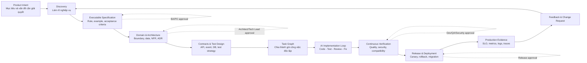
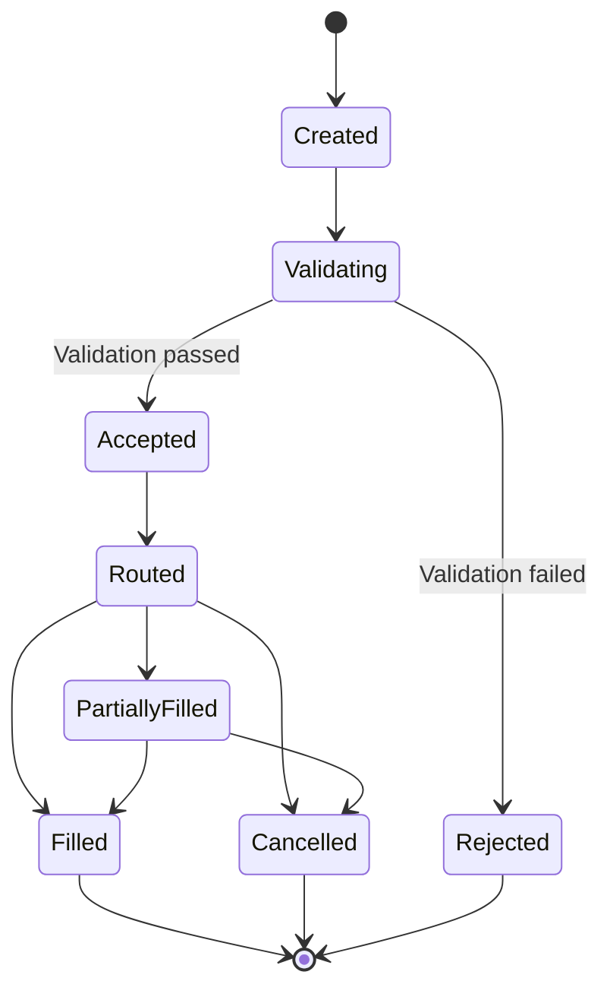
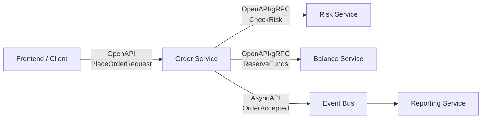
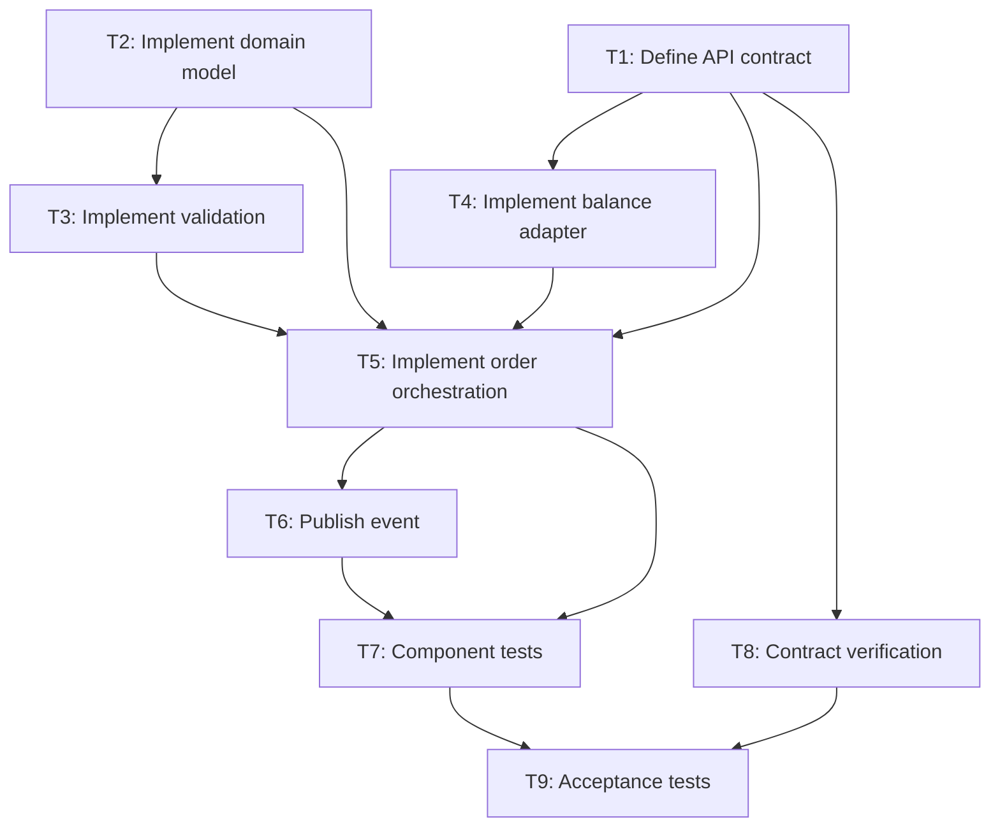
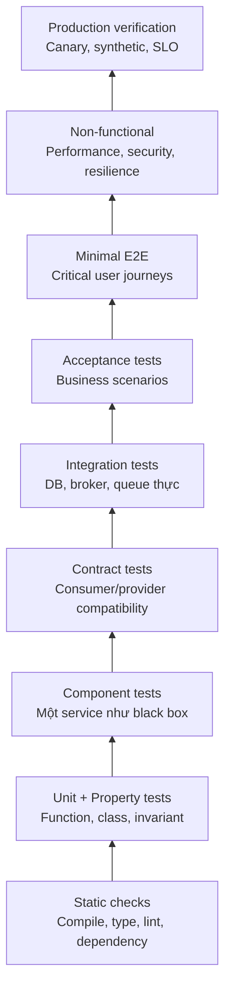
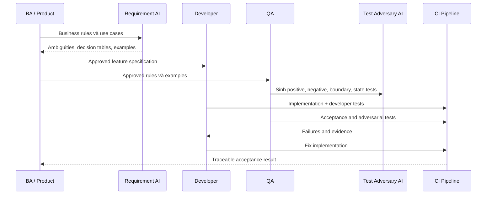
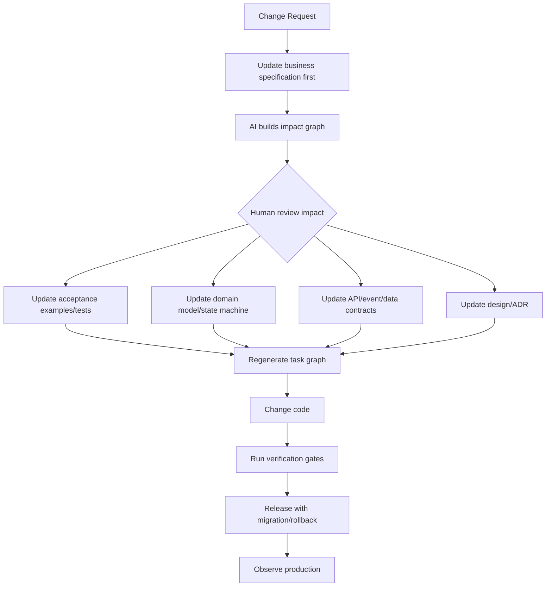
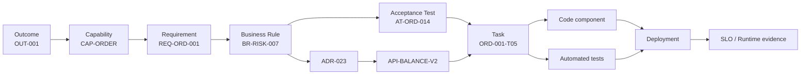
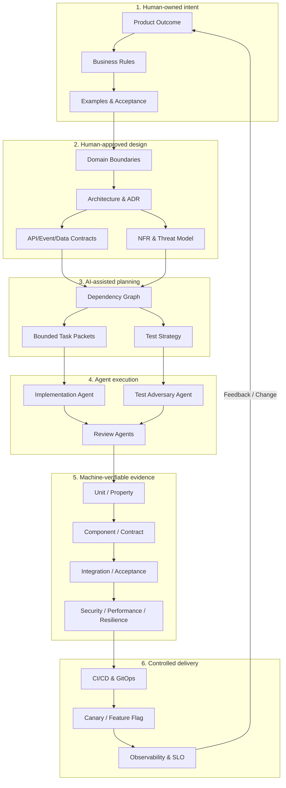

# Kết luận cốt lõi

Tư duy của bạn **đúng hướng**, đặc biệt ở ba điểm:

1. Chất lượng sản phẩm phụ thuộc trước hết vào việc **làm rõ nghiệp vụ, ràng buộc và tiêu chí đúng/sai**, không phải tốc độ sinh code.
2. Model mạnh nên xử lý phần có độ mơ hồ và “blast radius” lớn: phân tích nghiệp vụ, kiến trúc, tác động thay đổi, concurrency, security, data migration.
3. Model phổ thông có thể code rất tốt khi nhận được một **gói công việc nhỏ, đủ ngữ cảnh, input/output rõ ràng và có test tự động kiểm chứng**.

Tuy nhiên, có một điều cần điều chỉnh:

> Không nên viết tài liệu chi tiết cho mọi class, file và function trước khi code.

Cách đó dễ biến thành một “waterfall do AI tạo ra”: tài liệu khổng lồ, nhanh lỗi thời, tốn token và khó đồng bộ. Nên đặc tả chi tiết tại các **ranh giới ổn định** như nghiệp vụ, domain, API, event, dữ liệu, invariant và task; còn cấu trúc class/function phần lớn để developer và coding agent quyết định trong phạm vi đã được kiểm soát.

Tôi đề xuất quy trình kết hợp:

> **SDD + BDD/ATDD + Contract-First + TDD + Continuous Verification + DevSecOps/SRE**

Có thể gọi nội bộ là **Spec-to-Evidence Development**:

* **Spec** mô tả cần xây cái gì và vì sao.
* **Contract** mô tả các thành phần giao tiếp thế nào.
* **Test/Evidence** chứng minh hệ thống đang làm đúng.
* **Code** là hiện thực hóa của spec.
* **Observability** chứng minh hệ thống vẫn đúng khi chạy thực tế.

Các hướng SDD hiện nay như GitHub Spec Kit và Kiro đều đi theo chuỗi `requirements → design → tasks`, thay vì nhảy thẳng từ prompt sang code. DORA cũng kết luận AI chủ yếu là một “bộ khuếch đại”: tổ chức có quy trình tốt sẽ được khuếch đại tích cực, còn tổ chức thiếu kỷ luật có thể tạo lỗi và hỗn loạn nhanh hơn. ([GitHub][1])

---

# 1. Quy trình tổng thể đề xuất



Điểm quan trọng nhất là đây không phải chuỗi một chiều. Mỗi feature nhỏ đi qua vòng lặp này, thay vì thiết kế toàn bộ sản phẩm trong sáu tháng rồi mới code.

---

# 2. Các phương pháp nên kết hợp

## 2.1. SDD – Spec-Driven Development

SDD trả lời:

* Xây cái gì?
* Vì sao phải xây?
* Hệ thống phải có hành vi nào?
* Những nguyên tắc và giới hạn nào không được vi phạm?
* Thiết kế tổng thể ra sao?
* Chia thành những task nào?

SDD phù hợp với AI vì model hoạt động tốt hơn khi được cung cấp yêu cầu, ràng buộc và kế hoạch có cấu trúc. GitHub mô tả SDD theo hướng specification là artifact chính, từ đó tạo implementation plan và code; Kiro hiện thực hóa bằng ba nhóm artifact `requirements.md`, `design.md`, `tasks.md`. ([GitHub][1])

## 2.2. BDD/ATDD – hành vi và acceptance test

BDD giúp BA, DEV và QA cùng thống nhất hành vi bằng ví dụ cụ thể:

```gherkin
Scenario: Reject order when buying power is insufficient
  Given account A has available buying power of 1,000 USD
  When the customer places an order requiring 1,200 USD
  Then the order is rejected
  And no amount is reserved
  And rejection reason is "INSUFFICIENT_BUYING_POWER"
```

BDD không chỉ là viết Gherkin. Quy trình đúng gồm:

1. **Discovery:** BA, DEV, QA trao đổi các trường hợp cụ thể.
2. **Formulation:** chuyển chúng thành rule, example, decision table.
3. **Automation:** tự động hóa các ví dụ thành acceptance test.

Đây cũng là cách Cucumber định nghĩa BDD: cộng tác liên vai trò, làm việc theo vòng lặp nhỏ và tạo tài liệu có thể tự kiểm tra với hành vi thật của hệ thống. ([Cucumber][2])

## 2.3. Contract-First và Contract Testing

Đối với hệ thống nhiều service, không thể chỉ dựa vào mock do từng team tự nghĩ ra.

Cần có contract máy đọc được:

* HTTP/REST: OpenAPI.
* Event/Kafka/RabbitMQ: AsyncAPI.
* gRPC: Protobuf.
* Database: schema và migration contract.
* Consumer expectation: consumer-driven contract như Pact.

OpenAPI có thể dùng để sinh documentation, client, server stub và test; AsyncAPI đóng vai trò hợp đồng giữa producer và consumer của message/event. ([OpenAPI Initiative][3])

## 2.4. TDD

TDD dùng ở cấp implementation:

```text
Viết test đỏ → viết code tối thiểu → test xanh → refactor
```

TDD không thay thế SDD:

* SDD đảm bảo **xây đúng thứ cần xây**.
* BDD/ATDD đảm bảo **đúng hành vi nghiệp vụ**.
* Contract testing đảm bảo **các service hiểu nhau**.
* TDD đảm bảo **logic bên trong được triển khai đúng và dễ thay đổi**.

## 2.5. Property-based và Model-based Testing

Với hệ thống tài chính, trading, ledger hoặc state machine, test từng ví dụ cụ thể là chưa đủ.

Nên kiểm tra các invariant, ví dụ:

```text
available_balance >= 0
reserved_balance >= 0

total_balance =
    available_balance
  + reserved_balance
  + pending_withdrawal

Một idempotency key không được tạo hai order.

Một lượng tiền không được reserve hai lần dù có concurrent request.
```

AI rất phù hợp để sinh hàng nghìn tổ hợp input, nhưng invariant phải được con người hiểu nghiệp vụ phê duyệt.

---

# 3. Quy trình chi tiết từ yêu cầu đến production

## Giai đoạn 0 – Product framing

### Mục tiêu

Không bắt đầu bằng “hãy xây hệ thống X”, mà phải trả lời:

* Vấn đề thực sự là gì?
* Người dùng nào gặp vấn đề?
* Outcome đo bằng gì?
* Phạm vi MVP là gì?
* Điều gì cố ý chưa làm?
* Rủi ro kinh doanh lớn nhất là gì?

### Artifact

```text
product-brief.md
success-metrics.md
scope.md
glossary.md
assumptions.md
open-questions.md
```

### AI hỗ trợ

* Phát hiện yêu cầu mang tính giải pháp nhưng chưa nêu vấn đề.
* Tìm mâu thuẫn giữa mục tiêu và phạm vi.
* Sinh câu hỏi làm rõ.
* Phân loại assumption, fact và decision.
* Mô phỏng góc nhìn khách hàng, vận hành, compliance và support.

### Human gate

PO hoặc business owner phê duyệt outcome và phạm vi.

---

## Giai đoạn 1 – Business discovery

Nên tổ chức workshop kiểu “Three Amigos”:

* BA/PO: hiểu nghiệp vụ.
* DEV/Architect: hiểu tính khả thi và failure mode.
* QA: tìm trường hợp biên và cách kiểm chứng.

### BA không chỉ viết use case

BA cần mô hình hóa:

* Actor và permission.
* Happy path.
* Alternative path.
* Exception path.
* State transition.
* Decision table.
* Business formula.
* Invariant.
* Thời điểm hiệu lực.
* Audit requirement.
* Data ownership.
* Chính sách retry, timeout và duplicate.
* Trường hợp concurrent.
* Manual operation và reconciliation.

Ví dụ state machine:



### AI phải xuất ra “unknown”, không được tự bịa

Kết quả AI nên chia thành:

```text
Confirmed facts
Explicit decisions
Assumptions requiring confirmation
Contradictions
Open questions
Missing edge cases
```

Đây là nguyên tắc quan trọng. AI không được âm thầm “hoàn thiện” nghiệp vụ bằng những giả định hợp lý nhưng chưa được business quyết định.

---

## Giai đoạn 2 – Executable feature specification

Mỗi feature nên có một thư mục độc lập:

```text
specs/features/ORD-001-place-order/
├── requirements.md
├── business-rules.md
├── examples.feature
├── decision-table.md
├── state-machine.md
├── nfr.md
├── assumptions.md
└── trace.yaml
```

### Nội dung tối thiểu

```yaml
id: ORD-001
title: Place cash equity order
owner: order-domain
status: approved

actors:
  - retail-client
  - advisor

preconditions:
  - account is active
  - market is available

business_rules:
  - BR-ORD-001
  - BR-RISK-007

acceptance_tests:
  - AT-ORD-001
  - AT-ORD-002

depends_on:
  - API-BALANCE-V2
  - EVT-ORDER-V1

non_goals:
  - margin trading
  - basket orders
```

### Definition of “Spec Ready”

Một spec chỉ được coi là ready khi:

* Có mục tiêu và phạm vi.
* Có business rule định danh.
* Có positive, negative và boundary example.
* Không còn câu hỏi blocking.
* Có acceptance criteria kiểm chứng được.
* Có NFR liên quan.
* Có owner phê duyệt.
* Không dùng các từ mơ hồ như “nhanh”, “hợp lý”, “thân thiện” mà không có ngưỡng đo.

---

## Giai đoạn 3 – Domain và kiến trúc

Đây là nơi model mạnh hỗ trợ rất nhiều, nhưng không nên để AI tự quyết định.

### Các artifact cần có

* Domain capability map.
* Bounded context và context map.
* C4 Context diagram.
* C4 Container diagram.
* Component diagram khi thực sự cần.
* Sequence diagram cho flow quan trọng.
* Data ownership.
* Failure model.
* NFR.
* Threat model.
* ADR.

C4 gồm các mức Context, Container, Component và Code; chính tác giả C4 lưu ý phần lớn team chỉ cần Context và Container, không nhất thiết phải vẽ mọi class. ([C4 model][4])

### Về cách gọi service, module và namespace

Cách gọi chính xác hơn:

```text
Software System
└── Service hoặc Deployable
    └── Module / Package / Project
        └── Class / Component
            └── Method / Function
```

`Namespace` chủ yếu là cơ chế tổ chức tên của ngôn ngữ, không phải lúc nào cũng là một architectural boundary.

Ví dụ:

| Công nghệ  | Phân cấp thường dùng                                             |
| ---------- | ---------------------------------------------------------------- |
| Java       | Service → Maven/Gradle module → package → class → method         |
| .NET       | Service → solution/project/assembly → namespace → class → method |
| TypeScript | Service → package/module → directory/file → class/function       |
| Go         | Service → module → package → file → function/type                |

### Chia service theo đâu?

Không chia service theo:

* Số lượng developer.
* Số lượng class.
* Mỗi feature một service.
* Khả năng AI code độc lập.
* Một bảng database một service.

Nên chia theo:

* Business capability.
* Bounded context.
* Ownership dữ liệu.
* Nhịp thay đổi.
* Yêu cầu scale và availability.
* Nhu cầu deploy độc lập.
* Mức coupling transaction.

Microsoft cũng khuyến nghị một microservice thường không nên trải qua nhiều bounded context, đồng thời nhấn mạnh việc xác định boundary phải mang tính thực dụng và lặp dần. ([Microsoft Learn][5])

### Model mạnh làm gì?

Model mạnh nên:

1. Đưa ra 2–3 phương án kiến trúc.
2. Phân tích trade-off.
3. Liệt kê failure mode.
4. Phân tích consistency và transaction boundary.
5. Phân tích concurrency.
6. Phân tích security.
7. Đánh giá migration và rollback.
8. Sinh Mermaid/C4 draft.
9. So sánh với architecture principles.
10. Viết ADR nháp.

Tech Lead hoặc Architect phải quyết định và ký ADR.

---

## Giai đoạn 4 – Contract và test design trước code

Trước khi hai team code song song, phải khóa các contract cần thiết.



Mỗi contract cần chỉ rõ:

* Schema.
* Required/optional field.
* Semantic của từng field.
* Error code.
* Timeout.
* Retry.
* Idempotency.
* Authentication và authorization.
* Version compatibility.
* Event ordering.
* Duplicate handling.
* Schema evolution.

### Giả lập service khác thế nào?

Nên dùng bốn mức:

1. **Mock:** unit test, rất nhanh.
2. **Contract-verified stub:** mock được sinh hoặc kiểm tra theo contract thật.
3. **Ephemeral real dependency:** chạy database, Kafka, Redis hoặc provider bằng container.
4. **Full environment:** một số ít E2E quan trọng.

Không nên mock toàn bộ hệ thống rồi coi như integration test. Pact kiểm tra từng consumer/provider độc lập theo contract; Testcontainers cho phép chạy dependency thực trong container, tránh sai khác giữa mock và production service. ([Pact Docs][6])

---

## Giai đoạn 5 – Lập task graph cho AI agent

Từ feature spec và technical design, model mạnh tạo dependency graph.



### Một task packet tốt cho coding agent

```markdown
# TASK ORD-001-T05

## Goal
Implement order orchestration for accepted cash equity orders.

## In scope
- services/order/src/application/place-order/*
- services/order/test/component/place-order/*

## Out of scope
- Margin orders
- Exchange routing implementation
- UI changes

## Upstream specifications
- BR-ORD-001
- BR-RISK-007
- API-BALANCE-V2
- EVT-ORDER-V1

## Inputs
PlaceOrderCommand

## Outputs
- AcceptedOrder
- Domain rejection with documented error code

## Invariants
- Funds must be reserved before OrderAccepted is persisted.
- Repeated idempotency key must return the original result.
- Failed reservation must not create an accepted order.

## Failure cases
- Balance timeout
- Insufficient balance
- Duplicate request
- Concurrent reservation conflict

## Tests required
- Unit tests
- Component tests
- Idempotency test
- Concurrent request test

## Commands
./gradlew order-service:test

## Definition of done
- All existing and new tests pass
- No contract compatibility violation
- No new high-severity security finding
- Documentation and trace links updated
```

Đây chính là loại công việc model phổ thông có thể thực hiện tốt.

### Không nên quy định sẵn class và function khi không cần

Chỉ quy định tới function/pseudocode khi:

* Thuật toán tài chính phức tạp.
* Có yêu cầu performance đặc biệt.
* Có concurrency hoặc lock ordering.
* Có security-sensitive logic.
* Có backward compatibility khó.
* Cần triển khai giống một reference algorithm.

Các CRUD thông thường chỉ cần goal, contract, invariant và test.

---

# 4. Phân công model theo rủi ro, không chỉ theo giá model

Ý tưởng “model mạnh thiết kế, model vừa code” đúng nhưng chưa đủ. Nên định tuyến theo hai biến:

* **Độ mơ hồ.**
* **Blast radius:** nếu sai thì ảnh hưởng lớn đến đâu.

| Mơ hồ | Blast radius | Cách xử lý                                                      |
| ----- | -----------: | --------------------------------------------------------------- |
| Thấp  |         Thấp | Model phổ thông code, CI tự kiểm tra                            |
| Cao   |         Thấp | Model mạnh làm rõ và lập plan, model phổ thông code             |
| Thấp  |          Cao | Model phổ thông có thể code, nhưng model mạnh và human review   |
| Cao   |          Cao | Model mạnh + senior engineer cùng thiết kế; không tự động merge |

Nhóm blast radius cao gồm:

* Tiền và ledger.
* Order và position.
* Authentication, permission.
* Encryption và secret.
* Database migration.
* Concurrency.
* Settlement.
* Production infrastructure.
* Regulatory reporting.

## Các AI role nên có

```text
Requirement Critic Agent
Architecture Agent
Implementation Planner
Coding Agent
Test Adversary Agent
Security Reviewer
Contract Compatibility Reviewer
Documentation/Trace Sync Agent
Release Readiness Agent
```

Không nhất thiết dùng tám model khác nhau. Có thể dùng cùng một hệ thống nhưng với:

* Prompt riêng.
* Context riêng.
* Quyền tool riêng.
* Tiêu chí đánh giá riêng.

Điều quan trọng là **implementation agent không được tự chấm toàn bộ bài của chính nó**.

---

# 5. Chiến lược test đầy đủ nhưng không làm CI quá chậm

## Các tầng kiểm thử



## Chạy test theo thời điểm

| Thời điểm      | Test nên chạy                                                  |
| -------------- | -------------------------------------------------------------- |
| Trong IDE      | Unit, targeted component                                       |
| Mỗi commit/PR  | Compile, lint, unit, component, contract, targeted integration |
| Merge vào main | Acceptance, security scan, compatibility, broader integration  |
| Nightly        | Full integration, mutation test, extended acceptance           |
| Pre-release    | E2E, migration, rollback, performance, load, stress            |
| Theo lịch      | Soak test, chaos/resilience, dependency upgrade verification   |
| Production     | Canary, synthetic test, SLO, anomaly detection                 |

Không nên chạy toàn bộ stress test trên mọi PR. Điều đó vừa chậm vừa tạo noise.

## Phân biệt load, stress và soak

* **Load test:** hệ thống chịu tải dự kiến không?
* **Stress test:** điểm gãy ở đâu và gãy thế nào?
* **Spike test:** tăng tải đột ngột thì sao?
* **Soak test:** chạy lâu có memory leak, connection leak không?
* **Capacity test:** một instance hoặc cluster xử lý tối đa bao nhiêu?
* **Resilience test:** dependency timeout, queue lag, node chết thì sao?

## Tránh lỗi “AI viết code và AI viết test cùng sai”

Các biện pháp:

1. Dùng acceptance criteria do BA/QA sở hữu.
2. Test agent độc lập với coding agent.
3. Test agent không đọc implementation ở vòng đầu.
4. Dùng property-based test.
5. Dùng mutation testing để xem test có thực sự bắt lỗi.
6. Với công thức tài chính, có reference model độc lập.
7. QA review coverage theo business rule, không chỉ code coverage.
8. Fuzz các input và sequence bất thường.
9. Production monitoring kiểm tra invariant.

Code coverage cao không đồng nghĩa test tốt. Mutation score, escaped defect và khả năng bắt regression thường có ý nghĩa hơn.

---

# 6. BA và QA phối hợp sinh test từ tài liệu thế nào?



### Phân quyền sở hữu test

| Loại test                         | Owner chính                  |
| --------------------------------- | ---------------------------- |
| Business acceptance               | BA/PO + QA                   |
| Test strategy, negative, boundary | QA                           |
| Unit/component                    | DEV                          |
| Contract                          | DEV của consumer và provider |
| Performance                       | QA performance + DEV/SRE     |
| Security                          | Security + DEV               |
| Production verification           | SRE/Platform + DEV           |

DEV có thể dùng AI sinh acceptance test nháp, nhưng không nên là người duy nhất quyết định expected behavior.

---

# 7. Cách quản lý “source of truth”

Không nên cố ép mọi thứ vào một tài liệu duy nhất.

Nên có **source of truth theo từng concern**:

| Concern               | Source of truth                        |
| --------------------- | -------------------------------------- |
| Product outcome       | Product brief                          |
| Business behavior     | Feature spec, rule, acceptance example |
| Architecture decision | ADR                                    |
| HTTP interface        | OpenAPI                                |
| Event interface       | AsyncAPI/Protobuf                      |
| Database structure    | Migration/schema                       |
| Implementation        | Code                                   |
| Correctness evidence  | Automated tests                        |
| Runtime reality       | Metrics, logs, traces, SLO             |

Các artifact phải được lưu cùng Git hoặc version control tương đương và có liên kết truy vết.

Một PR cho feature nên chứa đồng thời:

```text
Spec change
Contract change
Architecture/ADR change nếu cần
Test change
Code change
Migration
Observability
Runbook
Release note
```

Không nên merge code trước rồi “sau này cập nhật tài liệu”.

---

# 8. Khi BA thay đổi logic, hệ thống apply xuống thế nào?

Đây là phần quan trọng nhất với dự án lớn.



## Bước 1: Spec thay đổi trước

Ví dụ:

```text
BR-RISK-007 v1:
Reject order when available buying power < required amount.

BR-RISK-007 v2:
Reject order when adjusted buying power after pending fees
is lower than required amount.
```

## Bước 2: AI tạo impact graph

AI tìm:

* Acceptance test tham chiếu `BR-RISK-007`.
* Service sử dụng rule.
* API có field liên quan.
* Event downstream.
* Database column.
* Report.
* Monitoring.
* Runbook.
* Các version đang support.

## Bước 3: Human xác nhận impact

AI chỉ đề xuất. Domain owner và Tech Lead phải xác nhận:

* Thành phần nào thực sự cần đổi?
* Có breaking change không?
* Có migration không?
* Có backward compatibility không?
* Có cần dual-read/dual-write không?
* Có cần feature flag không?

## Bước 4: Update theo thứ tự

```text
Business rule
→ Acceptance examples
→ Domain model
→ Contract
→ Data migration
→ Architecture decision
→ Task graph
→ Tests
→ Code
→ Operational artifact
```

## Bước 5: CI kiểm tra tính nhất quán

Pipeline nên fail khi:

* Business rule mới chưa có acceptance test.
* OpenAPI đổi nhưng không chạy compatibility check.
* Event schema breaking nhưng chưa tăng version.
* Migration không có rollback hoặc forward recovery plan.
* Code tham chiếu spec ID không tồn tại.
* Spec được phê duyệt nhưng implementation chưa cập nhật.
* Diagram hoặc generated documentation bị drift.
* Performance budget bị vượt.
* Security policy bị vi phạm.

---

# 9. Traceability graph nên được xây thế nào?

Mỗi artifact có ID ổn định.



Khi thay đổi một node, AI đi cả hai chiều để tìm vùng ảnh hưởng.

Không cần xây graph database ngay từ đầu. Giai đoạn đầu có thể dùng YAML metadata và script kiểm tra.

---

# 10. Cấu trúc repository gợi ý

```text
/
├── AGENTS.md
├── docs/
│   ├── product/
│   │   ├── product-brief.md
│   │   ├── glossary.md
│   │   └── success-metrics.md
│   ├── domain/
│   │   ├── capability-map.md
│   │   ├── context-map.md
│   │   └── business-rules/
│   ├── architecture/
│   │   ├── context.md
│   │   ├── containers.md
│   │   ├── sequences/
│   │   └── adr/
│   └── operations/
│       ├── slo.md
│       └── runbooks/
│
├── specs/
│   └── features/
│       └── ORD-001-place-order/
│           ├── requirements.md
│           ├── examples.feature
│           ├── design.md
│           ├── tasks.md
│           └── trace.yaml
│
├── contracts/
│   ├── openapi/
│   ├── asyncapi/
│   ├── protobuf/
│   └── schemas/
│
├── services/
│   ├── order-service/
│   │   ├── AGENTS.md
│   │   ├── src/
│   │   └── test/
│   ├── risk-service/
│   └── balance-service/
│
├── quality/
│   ├── test-strategy.md
│   ├── performance-budgets.yaml
│   ├── security-policies.yaml
│   └── traceability-rules.yaml
│
└── deployment/
    ├── infrastructure/
    ├── environments/
    └── gitops/
```

Các coding agent hiện đại có thể dùng instruction file theo repository hoặc thư mục. GitHub hỗ trợ repository-wide instructions, path-specific instructions và `AGENTS.md`, trong đó file gần thư mục đang thao tác hơn có thể cung cấp chỉ dẫn cục bộ. OpenAI cũng khuyến nghị coding agent cần môi trường đã cấu hình, test đáng tin cậy, tài liệu rõ ràng và instruction file trong repository. ([GitHub Docs][7])

---

# 11. Nội dung của `AGENTS.md`

`AGENTS.md` không nên chứa toàn bộ tài liệu nghiệp vụ. Nó là “hướng dẫn làm việc trong repository”.

```markdown
# Repository instructions

## Architecture
- Services communicate only through declared contracts.
- A service must not access another service's database.
- Domain logic must not depend on infrastructure packages.

## Required workflow
1. Read the referenced feature spec.
2. Read relevant ADRs and contracts.
3. Add or update tests before implementation.
4. Run required validation commands.
5. Report assumptions and unresolved questions.

## Prohibited actions
- Do not change public API without updating OpenAPI.
- Do not introduce new dependencies without approval.
- Do not access production credentials.
- Do not weaken tests to make them pass.
- Do not silently catch or ignore exceptions.

## Commands
- Unit test: ...
- Component test: ...
- Contract test: ...
- Lint: ...
- Security scan: ...

## Definition of done
...
```

Mỗi service có thể có `AGENTS.md` riêng mô tả:

* Cấu trúc module.
* Coding convention.
* Test convention.
* Domain invariant.
* Các command.
* Những file không được sửa.

---

# 12. Governance cho AI

AI không phải người chịu trách nhiệm cuối cùng.

## Những việc có thể tự động hóa mạnh

* Sinh boilerplate.
* Sinh test data.
* Viết unit test cơ bản.
* Refactor cục bộ.
* Cập nhật documentation.
* Sinh client từ contract.
* Phân tích dependency.
* Review style và pattern.
* Triage lỗi CI.
* Nâng dependency rủi ro thấp.
* Sinh release note.

## Những việc cần human approval

* Thay đổi business rule.
* Thay đổi tiền, ledger, order, position.
* Kiến trúc và service boundary.
* Public contract breaking change.
* Database migration phá hủy dữ liệu.
* Security/auth/permission.
* Production infrastructure.
* SLO và capacity.
* Merge high-risk change.
* Production deployment quan trọng.

## Kiểm soát môi trường agent

* Agent chạy sandbox.
* Không có production credential.
* Quyền ghi giới hạn theo repository/path.
* Mọi tool call có audit log.
* Secret scanning trước khi gửi context.
* Data classification cho source code và tài liệu.
* Danh sách model/provider được phê duyệt.
* Không gửi PII hoặc secret sang model không phù hợp.
* Pin dependency và kiểm tra supply chain.

OWASP SAMM là một framework risk-driven để đánh giá và cải thiện secure development lifecycle xuyên suốt tổ chức, phù hợp để làm nền cho governance này. ([OWASP][8])

---

# 13. Quality gates đề xuất

## Gate 1 – Spec Ready

* Business owner phê duyệt.
* Rule và example rõ.
* Không còn câu hỏi blocking.
* Có NFR và out-of-scope.

## Gate 2 – Design Ready

* Boundary và data ownership rõ.
* API/event contract được review.
* Failure mode được phân tích.
* ADR cho quyết định quan trọng.
* Có test strategy.
* Có migration/compatibility strategy nếu cần.

## Gate 3 – Build Ready

* Task đủ nhỏ.
* Mỗi task có input/output, invariant và DoD.
* Có dependency graph.
* Agent biết các file được phép thay đổi.
* Dev environment và command chạy được.

## Gate 4 – Merge Ready

* Test bắt buộc pass.
* Contract compatible.
* Security scan pass.
* Strong-model review cho phần rủi ro.
* Human review phần nghiệp vụ và kiến trúc.
* Spec/code/test cùng được cập nhật.

## Gate 5 – Release Ready

* Migration verified.
* Rollback hoặc forward recovery plan.
* Feature flag/canary nếu cần.
* Dashboard và alert đã có.
* Runbook và release note đầy đủ.

## Gate 6 – Production Verified

* SLO không suy giảm.
* Không vi phạm invariant.
* Business metric đúng kỳ vọng.
* Không tăng error, latency hoặc resource bất thường.
* Có post-release review.

---

# 14. Vai trò của từng thành viên trong team AI-native

| Vai trò             | Trách nhiệm chính                                        |
| ------------------- | -------------------------------------------------------- |
| Product Owner       | Outcome, scope, priority, acceptance cuối                |
| BA                  | Business rule, glossary, example, traceability           |
| Architect/Tech Lead | Boundary, NFR, ADR, integration, technical risk          |
| Developer           | Implementation, unit/component test, maintainability     |
| QA                  | Risk model, acceptance, negative/boundary, test evidence |
| Security            | Threat model, policy, security test                      |
| Platform/SRE        | CI/CD, environment, observability, SLO, release safety   |
| AI Platform/DevEx   | Agent instructions, model routing, cost, audit, tooling  |

Head project không nên review từng function. Vai trò của Head là xây:

* Hệ thống artifact chuẩn.
* Các approval gate.
* Ownership rõ.
* Golden path.
* Automated quality gates.
* Cơ chế escalation theo risk.
* Metrics đánh giá hiệu quả.

---

# 15. Những sai lầm nên tránh

## 1. AI tạo tài liệu cực chi tiết rồi xem đó là sự thật

Tài liệu lớn rất dễ drift. Hãy tập trung vào rule, contract, invariant và decision.

## 2. Dùng cùng một model viết code, viết test và tự xác nhận

Điều này tạo correlated error: model hiểu sai một lần rồi lặp lại cùng sai lầm ở cả code lẫn test.

## 3. Coverage cao nhưng không test nghiệp vụ

100% line coverage vẫn có thể sai công thức hoặc sai state transition.

## 4. Chia microservice quá sớm

AI làm code rẻ hơn nhưng không làm distributed transaction, observability, deployment và incident rẻ tương ứng.

## 5. Để AI tự điền requirement thiếu

AI phải đưa ra câu hỏi và assumption, không tự quyết định nghiệp vụ.

## 6. Mọi task đều dùng model mạnh nhất

Tốn chi phí và giảm throughput. Nên routing theo ambiguity và blast radius.

## 7. Cho agent quyền quá lớn

Không cho agent production credential hoặc quyền sửa toàn repository một cách mặc định.

## 8. Tạo hàng nghìn test nhưng không có test strategy

Số test lớn gây chậm, flaky và khó bảo trì. Mỗi test phải bảo vệ một rule, invariant hoặc risk cụ thể.

---

# 16. Lộ trình áp dụng thực tế

## Giai đoạn 1 – Chuẩn hóa nền tảng

Chọn một feature có độ phức tạp vừa phải.

Xây:

* Template product brief.
* Template feature spec.
* Template ADR.
* Task packet.
* `AGENTS.md`.
* Test strategy.
* CI quality gates cơ bản.
* OpenAPI/AsyncAPI validation.
* Trace ID giữa spec, test và code.

Chưa cần multi-agent phức tạp.

## Giai đoạn 2 – AI-assisted workflow

Áp dụng:

* Requirement critic.
* Architecture option generation.
* Task decomposition.
* Coding agent cho task nhỏ.
* Independent AI code review.
* Independent QA test generation.
* Automated documentation synchronization.

## Giai đoạn 3 – Multi-team scale

Bổ sung:

* Contract registry.
* Dependency/impact graph.
* Ownership catalog.
* Architecture fitness functions.
* Cross-service test environment.
* Compatibility and migration gates.
* Model routing theo risk.
* Cost và quality dashboard.

## Giai đoạn 4 – Agentic delivery có kiểm soát

Cho phép agent tự động:

* Nhận task.
* Tạo branch.
* Implement.
* Chạy test.
* Tự review.
* Mời reviewer agent khác.
* Sửa feedback.
* Tạo PR.

Nhưng merge và production deployment vẫn theo risk policy.

---

# Mô hình cuối cùng tôi khuyến nghị



## Nguyên tắc ngắn gọn nhất

> **Con người sở hữu intent và quyết định. Model mạnh xử lý ambiguity và risk. Model phổ thông thực hiện task đã được giới hạn. Test, contract và production evidence quyết định code có đúng hay không.**

Bước triển khai hợp lý nhất cho project lớn của bạn là chuẩn hóa trước bốn artifact: **Feature Spec, Technical Design/ADR, Task Packet và Test Evidence**, sau đó mới lựa chọn và ghép các AI agent vào từng điểm của quy trình.

[1]: https://github.com/github/spec-kit/blob/main/spec-driven.md "spec-kit/spec-driven.md at main · github/spec-kit · GitHub"
[2]: https://cucumber.io/docs/bdd/ "Behaviour-Driven Development | Cucumber"
[3]: https://www.openapis.org/?utm_source=chatgpt.com "OpenAPI Initiative – The OpenAPI Initiative provides an open ..."
[4]: https://c4model.com/diagrams?utm_source=chatgpt.com "Diagrams | C4 model"
[5]: https://learn.microsoft.com/en-us/azure/architecture/microservices/model/microservice-boundaries?utm_source=chatgpt.com "Identify microservice boundaries - Azure Architecture Center | Microsoft Learn"
[6]: https://docs.pact.io/ "Introduction | Pact Docs"
[7]: https://docs.github.com/copilot/customizing-copilot/adding-custom-instructions-for-github-copilot "Adding repository custom instructions for GitHub Copilot - GitHub Docs"
[8]: https://owasp.org/www-project-samm/ "OWASP SAMM | OWASP Foundation"
