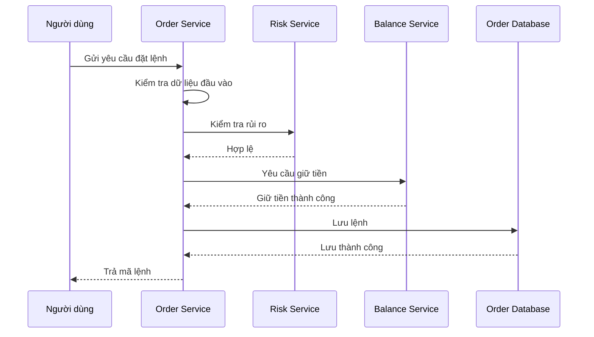
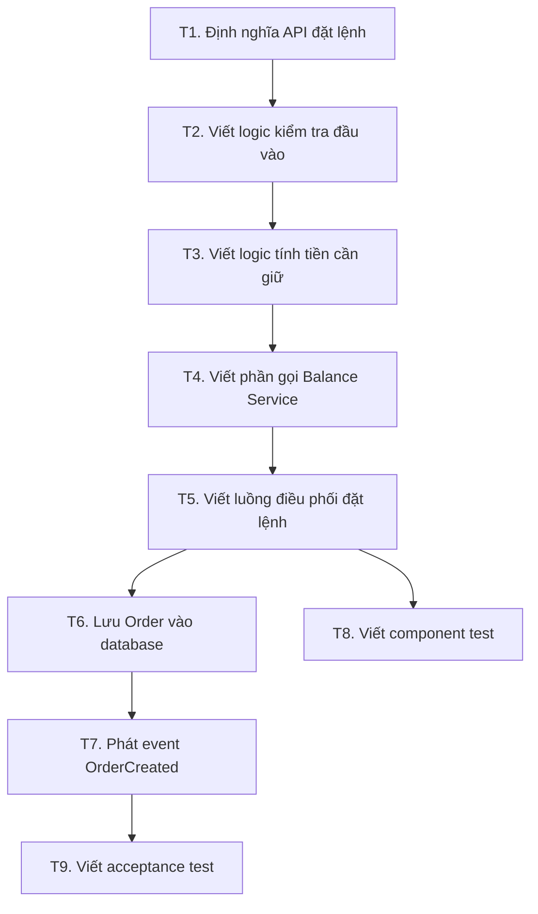
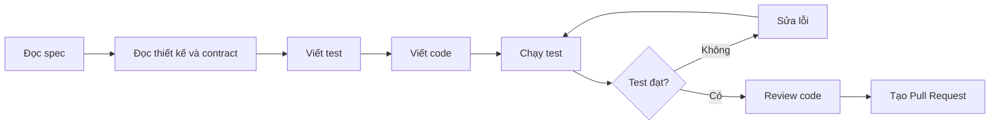

Đúng, phần trước bị dàn trải. Tôi tập trung **chỉ vào quy trình từ lúc nhận yêu cầu đến khi chạy trên production**, theo cách một team BA–DEV–QA có AI nên vận hành.

Giả sử yêu cầu là:

> Xây chức năng cho phép khách hàng đặt lệnh mua chứng khoán.

---

# 1. Sơ đồ toàn bộ quy trình

```mermaid
flowchart LR
    A["1. Tiếp nhận yêu cầu"]
    B["2. Làm rõ nghiệp vụ"]
    C["3. Chốt đặc tả và tiêu chí nghiệm thu"]
    D["4. Thiết kế kỹ thuật"]
    E["5. Chốt API, dữ liệu và kế hoạch test"]
    F["6. Chia nhỏ thành task"]
    G["7. DEV và AI viết code"]
    H["8. Kiểm thử và review"]
    I["9. Triển khai thử"]
    J["10. Triển khai production"]
    K["11. Theo dõi và phản hồi"]

    A --> B --> C --> D --> E --> F --> G --> H --> I --> J --> K
```



Điểm cần hiểu:

> Không phải BA viết tài liệu xong rồi “ném” cho DEV.
> BA, DEV và QA phải cùng tham gia ngay từ giai đoạn làm rõ nghiệp vụ.

Nếu đợi BA viết xong toàn bộ rồi DEV mới đọc, rất dễ xảy ra:

* BA viết điều không thể triển khai.
* DEV hiểu khác ý BA.
* QA phát hiện lỗ hổng quá muộn.
* Phải sửa tài liệu, thiết kế và code nhiều lần.

---

# 2. Bước 1 — Tiếp nhận yêu cầu

## Mục tiêu

Hiểu người yêu cầu thực sự muốn giải quyết vấn đề gì.

Yêu cầu ban đầu thường rất ngắn:

> Cần thêm chức năng đặt lệnh mua.

Nhưng câu này chưa đủ để làm phần mềm.

Team cần xác định:

* Ai sử dụng chức năng?
* Vì sao cần chức năng?
* Thành công được đo như thế nào?
* Phạm vi lần đầu đến đâu?
* Những gì chưa làm trong giai đoạn này?

## Ví dụ kết quả sau khi làm rõ sơ bộ

```text
Người dùng:
Khách hàng cá nhân có tài khoản chứng khoán.

Mục tiêu:
Cho phép khách hàng đặt lệnh mua cổ phiếu.

Phạm vi:
- Chỉ tài khoản tiền mặt.
- Chỉ lệnh giới hạn.
- Chưa hỗ trợ margin.
- Chưa hỗ trợ lệnh điều kiện.

Kết quả mong muốn:
- Lệnh hợp lệ được tiếp nhận.
- Lệnh không hợp lệ bị từ chối đúng lý do.
- Không giữ tiền sai.
- Không tạo trùng lệnh.
```

## Vai trò

* Product Owner hoặc người kinh doanh: đưa ra mục tiêu.
* BA: ghi nhận và tổ chức yêu cầu.
* DEV: đánh giá sơ bộ tính khả thi.
* QA: bắt đầu nghĩ về điều kiện đúng và sai.
* AI: sinh câu hỏi còn thiếu.

## Đầu ra

Một tài liệu ngắn gọi là **Product Brief** hoặc **Feature Brief**.

Nó trả lời:

```text
Vấn đề gì?
Ai gặp vấn đề?
Muốn đạt kết quả gì?
Làm đến đâu?
Không làm gì?
```

---

# 3. Bước 2 — Làm rõ nghiệp vụ

Đây là bước quan trọng nhất.

Nếu bước này sai, các bước phía sau có thể làm rất đẹp nhưng vẫn xây sai sản phẩm.

## BA cần làm gì?

BA phân tích toàn bộ hành vi của chức năng.

Không chỉ mô tả trường hợp thành công.

Phải xét ít nhất bốn nhóm:

### Trường hợp thành công

```text
Khách hàng nhập lệnh
→ tài khoản hợp lệ
→ thị trường đang mở
→ đủ tiền
→ hệ thống giữ tiền
→ tạo lệnh
→ trả mã lệnh
```

### Trường hợp thất bại

* Không đủ tiền.
* Tài khoản bị khóa.
* Mã chứng khoán không tồn tại.
* Giá không hợp lệ.
* Thị trường đóng cửa.
* Service kiểm tra số dư bị lỗi.

### Trường hợp biên

“Trường hợp biên” là trường hợp nằm đúng hoặc gần giới hạn.

Ví dụ:

* Số dư bằng chính xác số tiền cần mua.
* Giá bằng giá trần.
* Khối lượng bằng mức tối thiểu.
* Lệnh đến đúng thời điểm thị trường đóng.
* Hai lệnh được gửi cùng lúc.

### Trường hợp trùng lặp

Ví dụ mạng chậm khiến người dùng nhấn nút hai lần.

Hệ thống không được tạo hai lệnh nếu đó thực chất là cùng một yêu cầu.

## BA, DEV và QA phải họp cùng nhau

Cuộc trao đổi có thể diễn ra như sau:

```text
BA:
Nếu không đủ tiền thì từ chối lệnh.

DEV:
Đủ tiền được tính trước hay sau phí?

QA:
Nếu số dư đúng bằng tiền mua nhưng chưa tính phí thì sao?

BA:
Phải tính cả phí dự kiến.

DEV:
Nếu service tính phí bị timeout thì từ chối hay chờ xử lý?

Business:
Từ chối và cho phép khách hàng gửi lại.
```

Đây là giá trị lớn nhất của việc cùng phân tích sớm.

## AI hỗ trợ gì?

AI đọc yêu cầu và đưa ra:

```text
Điểm chưa rõ
Điểm mâu thuẫn
Giả định chưa được xác nhận
Trường hợp lỗi còn thiếu
Câu hỏi cần business quyết định
```

AI không được tự quyết định nghiệp vụ.

Ví dụ AI có thể hỏi:

* Phí được tính trước hay sau khi kiểm tra sức mua?
* Khi timeout có tự thử lại không?
* Có cho phép đặt lệnh ngoài giờ không?
* Hai request giống nhau được nhận diện bằng gì?

## Đầu ra

Sau bước này phải có:

* Quy tắc nghiệp vụ.
* Danh sách trạng thái.
* Luồng thành công.
* Luồng thất bại.
* Bảng quyết định.
* Các câu hỏi đã được chốt.

---

# 4. Bước 3 — Chốt đặc tả và tiêu chí nghiệm thu

Sau khi làm rõ nghiệp vụ, team chuyển nó thành một tài liệu có cấu trúc.

Tài liệu này gọi là **Feature Specification**, nghĩa là bản mô tả chính thức của chức năng.

## Một đặc tả cần có gì?

### Mục tiêu

```text
Cho phép khách hàng đặt lệnh mua cổ phiếu bằng tài khoản tiền mặt.
```

### Input

```text
accountId
symbol
price
quantity
orderType
idempotencyKey
```

`Input` là dữ liệu đầu vào.

### Output thành công

```text
orderId
status
reservedAmount
createdAt
```

`Output` là kết quả đầu ra.

### Quy tắc nghiệp vụ

```text
BR-ORDER-001:
Chỉ tài khoản ACTIVE được đặt lệnh.

BR-RISK-001:
Sức mua phải lớn hơn hoặc bằng tiền mua cộng phí dự kiến.

BR-ORDER-002:
Một idempotency key chỉ được tạo một lệnh.
```

Mỗi quy tắc nên có mã riêng để dễ truy vết.

### Tiêu chí nghiệm thu

**Tiêu chí nghiệm thu** là điều kiện để business nói:

> Chức năng này đã làm đúng yêu cầu.

Ví dụ:

```text
Khi tài khoản có đủ tiền,
và thị trường đang mở,
và lệnh hợp lệ,
hệ thống phải tạo lệnh và giữ tiền.
```

Hoặc viết theo dạng Given–When–Then:

```gherkin
Scenario: Đặt lệnh thành công

Given tài khoản đang hoạt động
And tài khoản có đủ tiền
And thị trường đang mở
When khách hàng đặt lệnh mua
Then hệ thống tạo một lệnh
And hệ thống giữ số tiền cần thiết
And trả về mã lệnh
```

## Ai phê duyệt?

* BA xác nhận tài liệu đúng nghiệp vụ.
* QA xác nhận có thể kiểm thử được.
* DEV xác nhận không còn điểm mơ hồ kỹ thuật nghiêm trọng.
* Product Owner hoặc business owner phê duyệt hành vi.

## Điều kiện để chuyển sang thiết kế kỹ thuật

Chỉ chuyển tiếp khi:

* Input và output rõ.
* Quy tắc nghiệp vụ rõ.
* Trường hợp lỗi rõ.
* Không còn câu hỏi chặn việc phát triển.
* Tiêu chí nghiệm thu có thể kiểm tra được.

---

# 5. Bước 4 — Thiết kế kỹ thuật

Sau khi biết hệ thống phải làm gì, DEV và Tech Lead thiết kế cách hệ thống thực hiện.

Đây là lúc trả lời:

* Phần code nào xử lý chức năng này?
* Service nào tham gia?
* Dữ liệu nằm ở đâu?
* Các service gọi nhau như thế nào?
* Nếu một service lỗi thì xử lý ra sao?
* Có nguy cơ tạo trùng hay sai tiền không?
* Hiệu năng cần đạt bao nhiêu?

## Ví dụ thiết kế luồng đặt lệnh



## DEV phải phân tích tình huống lỗi

Ví dụ:

### Giữ tiền thành công nhưng lưu lệnh thất bại

Khi đó tiền đã bị giữ nhưng không có lệnh.

Thiết kế phải quy định:

* Hoàn lại tiền ngay.
* Hoặc ghi một tác vụ bù để hoàn lại.
* Hoặc lưu trạng thái chờ xử lý.

Không thể bỏ trống.

### Hai request tới cùng lúc

Nếu tài khoản có 1.000 USD và hai lệnh cùng cần 800 USD:

```text
Lệnh A thấy đủ tiền.
Lệnh B cũng thấy đủ tiền.
```

Nếu xử lý sai, hệ thống có thể giữ 1.600 USD.

Thiết kế phải có cách ngăn điều này.

## Tài liệu thiết kế cần có

* Sơ đồ luồng.
* Service hoặc module thay đổi.
* API cần gọi.
* Dữ liệu cần lưu.
* Cách xử lý lỗi.
* Cách xử lý request trùng.
* Cách xử lý đồng thời.
* Yêu cầu bảo mật.
* Yêu cầu hiệu năng.
* Kế hoạch triển khai.

## AI model mạnh hỗ trợ

* Đề xuất nhiều phương án.
* So sánh ưu nhược điểm.
* Vẽ Mermaid.
* Tìm failure case.
* Phân tích concurrency.
* Phân tích security.
* Viết bản nháp thiết kế.

Nhưng Tech Lead phải chốt thiết kế.

---

# 6. Bước 5 — Chốt API, dữ liệu và kế hoạch test

Trước khi các DEV code song song, các điểm giao tiếp phải rõ.

## API là gì trong bước này?

API là cách một thành phần gọi thành phần khác.

Ví dụ Order Service gọi Balance Service:

```text
POST /balance-reservations
```

Request:

```json
{
  "accountId": "ACC-001",
  "amount": 1005,
  "referenceId": "ORDER-001"
}
```

Response:

```json
{
  "success": true,
  "reservationId": "RSV-001"
}
```

Cần thống nhất:

* Trường nào bắt buộc.
* Kiểu dữ liệu.
* Mã lỗi.
* Timeout bao lâu.
* Có retry không.
* Request trùng xử lý thế nào.
* Có tương thích với phiên bản cũ không.

## Kế hoạch test

QA và DEV cùng xác định cần những loại test nào.

Ví dụ:

| Loại test        | Kiểm tra gì                                        |
| ---------------- | -------------------------------------------------- |
| Unit test        | Công thức tính số tiền cần giữ                     |
| Component test   | Order Service xử lý request đúng                   |
| Contract test    | Order Service và Balance Service hiểu cùng một API |
| Integration test | Order Service hoạt động với database thật          |
| Acceptance test  | Nghiệp vụ đặt lệnh đúng                            |
| Concurrency test | Hai lệnh cùng lúc không làm âm tiền                |
| Performance test | Chịu được tải mong muốn                            |
| Security test    | Người dùng không đặt lệnh cho tài khoản khác       |

Điểm quan trọng:

> Test không được để đến sau khi code xong mới nghĩ.

Test phải được thiết kế từ lúc hiểu yêu cầu và kiến trúc.

---

# 7. Bước 6 — Chia nhỏ thành task

Không giao cho DEV hoặc AI:

> Làm chức năng đặt lệnh.

Yêu cầu đó quá lớn và mơ hồ.

Nên chia thành các task nhỏ.



## Một task tốt phải có

```text
Mục tiêu
Phạm vi được sửa
Phần không được sửa
Input
Output
Quy tắc nghiệp vụ
Tình huống lỗi
Test cần viết
Cách chạy test
Điều kiện hoàn thành
```

Ví dụ:

```text
Task:
Viết logic giữ tiền khi đặt lệnh.

Input:
accountId, amount, orderId.

Output:
reservationId hoặc lỗi nghiệp vụ.

Quy tắc:
- Không giữ tiền nếu không đủ số dư.
- Không giữ hai lần cho cùng orderId.
- Timeout không được coi là thành công.

Test:
- Đủ tiền.
- Không đủ tiền.
- Request trùng.
- Hai request đồng thời.
```

Đây là lúc model mạnh có thể chuẩn bị task rất rõ để model phổ thông code.

---

# 8. Bước 7 — DEV và AI viết code

Quy trình thực hiện một task nên như sau:



## Vai trò của AI

Model phổ thông hoặc Coding Agent có thể:

* Đọc task.
* Tìm file cần sửa.
* Viết test.
* Viết code.
* Chạy test.
* Đọc lỗi.
* Sửa code.
* Tạo PR.

## Vai trò của DEV

DEV phải kiểm tra:

* AI có hiểu đúng rule không?
* Code có dễ bảo trì không?
* Có làm hỏng module khác không?
* Có lỗi security không?
* Test có thực sự kiểm tra logic không?
* Có code thừa hoặc phức tạp không cần thiết không?

AI sinh code không có nghĩa DEV hết trách nhiệm.

DEV là người chịu trách nhiệm kỹ thuật cho thay đổi đó.

---

# 9. Bước 8 — Kiểm thử và review

Sau khi code xong, hệ thống cần nhiều lớp kiểm tra.

## Lớp 1: Kiểm tra tự động nhanh

* Code có biên dịch được không?
* Có lỗi cú pháp không?
* Có vi phạm quy tắc code không?
* Unit test có pass không?

## Lớp 2: Kiểm tra service

* API có hoạt động đúng không?
* Có ghi đúng database không?
* Có trả đúng mã lỗi không?

## Lớp 3: Kiểm tra giữa các service

* Order Service có gọi đúng Balance Service không?
* Request và response có đúng contract không?
* Event có đúng định dạng không?

## Lớp 4: Kiểm tra nghiệp vụ

QA chạy các tình huống:

* Đặt lệnh thành công.
* Không đủ tiền.
* Tài khoản khóa.
* Request trùng.
* Hai request cùng lúc.
* Service phụ bị timeout.

## Lớp 5: Review độc lập

Nên có ít nhất hai góc nhìn:

* AI Review Agent tìm lỗi kỹ thuật.
* Con người review phần nghiệp vụ và thiết kế quan trọng.

Không nên để cùng một AI:

```text
Viết code
→ viết test
→ tự review
→ tự kết luận đúng
```

Nó có thể lặp lại cùng một hiểu lầm.

---

# 10. Bước 9 — Triển khai lên môi trường thử

Không đưa thẳng lên production.

Thông thường có các môi trường:

```text
DEV → TEST/QA → UAT → PRODUCTION
```

## DEV

Môi trường để developer thử chức năng.

## TEST hoặc QA

Môi trường tester kiểm thử.

## UAT

**UAT** là User Acceptance Testing.

Đây là nơi người dùng nghiệp vụ hoặc business xác nhận:

> Chức năng có đúng với mong muốn thực tế không?

## Những việc cần kiểm tra

* Database migration có chạy được không?
* Cấu hình có đúng không?
* API giữa các service có kết nối không?
* Dữ liệu test có đúng không?
* Monitoring có nhận dữ liệu không?
* Có thể rollback không?

---

# 11. Bước 10 — Triển khai production

Production là môi trường người dùng thật đang sử dụng.

Không nên triển khai toàn bộ ngay lập tức với thay đổi rủi ro cao.

## Cách triển khai an toàn

### Feature Flag

Đưa code lên nhưng chưa bật chức năng.

```text
new_order_flow = false
```

Sau khi kiểm tra xong mới bật.

### Canary

Chỉ cho một phần nhỏ người dùng dùng phiên bản mới.

```text
5% người dùng → phiên bản mới
95% người dùng → phiên bản cũ
```

Nếu ổn thì tăng dần:

```text
5% → 20% → 50% → 100%
```

Nếu lỗi thì dừng hoặc quay lại.

## Trước khi triển khai phải có

* Test đạt.
* Người phê duyệt.
* Kế hoạch rollback.
* Database migration đã kiểm tra.
* Dashboard.
* Alert.
* Runbook xử lý sự cố.
* Danh sách rủi ro.

---

# 12. Bước 11 — Theo dõi sau triển khai

Deploy thành công chưa có nghĩa là chức năng thành công.

Phải theo dõi hệ thống chạy thật.

## Cần theo dõi gì?

### Technical metric

* Tỷ lệ lỗi.
* Thời gian phản hồi.
* CPU.
* Memory.
* Database connection.
* Queue backlog.

### Business metric

* Số lệnh được tạo.
* Số lệnh bị từ chối.
* Tỷ lệ lỗi không đủ tiền.
* Số request trùng.
* Số khoản tiền bị giữ nhưng không có lệnh.

### Log và Trace

Dùng để tìm:

* Request nào bị lỗi.
* Lỗi ở service nào.
* Bước nào chậm.
* Dữ liệu đã đi qua đâu.

## Ví dụ

Sau release thấy:

```text
Tỷ lệ timeout Balance Service tăng từ 0,1% lên 4%.
```

Team cần:

* Dừng rollout.
* Tắt feature flag.
* Quay lại phiên bản cũ.
* Phân tích nguyên nhân.
* Sửa rồi triển khai lại.

---

# 13. Ai làm gì trong toàn bộ quy trình?

| Bước                  | BA                 | DEV/Tech Lead                 | QA                       | AI                          |
| --------------------- | ------------------ | ----------------------------- | ------------------------ | --------------------------- |
| Tiếp nhận yêu cầu     | Phân tích mục tiêu | Đánh giá khả thi              | Nghĩ về khả năng test    | Sinh câu hỏi                |
| Làm rõ nghiệp vụ      | Chủ trì            | Tìm rủi ro kỹ thuật           | Tìm trường hợp thiếu     | Phát hiện mâu thuẫn         |
| Chốt đặc tả           | Viết và xác nhận   | Review                        | Review khả năng kiểm thử | Chuẩn hóa tài liệu          |
| Thiết kế kỹ thuật     | Giải đáp nghiệp vụ | Chủ trì                       | Góp ý testability        | Đề xuất kiến trúc           |
| Contract và test plan | Review             | Định nghĩa contract           | Chủ trì test plan        | Sinh test nháp              |
| Chia task             | Gắn rule           | Chủ trì                       | Gắn test case            | Chia task                   |
| Viết code             | Hỗ trợ nghiệp vụ   | Thực hiện và chịu trách nhiệm | Chuẩn bị test            | Code và test                |
| Kiểm thử              | Xác nhận hành vi   | Sửa lỗi                       | Chủ trì kiểm thử         | Review và sinh test         |
| Release               | Xác nhận nghiệp vụ | Hỗ trợ triển khai             | Xác nhận chất lượng      | Kiểm tra checklist          |
| Production            | Theo dõi business  | Theo dõi kỹ thuật             | Theo dõi lỗi             | Phân tích log và bất thường |

---

# 14. Các cổng kiểm soát bắt buộc

Để quy trình không trở thành hình thức, nên có bốn cổng chính.

## Cổng 1: Được phép thiết kế

Chỉ qua khi:

* Nghiệp vụ rõ.
* Business rule rõ.
* Trường hợp lỗi rõ.
* Tiêu chí nghiệm thu rõ.

## Cổng 2: Được phép code

Chỉ qua khi:

* Thiết kế được review.
* API và dữ liệu rõ.
* Task đủ nhỏ.
* Test plan đã có.

## Cổng 3: Được phép merge

Chỉ qua khi:

* Code review xong.
* Test pass.
* Không phá contract.
* Không có lỗi security nghiêm trọng.
* Tài liệu được cập nhật.

## Cổng 4: Được phép production

Chỉ qua khi:

* UAT đạt.
* Migration đã kiểm tra.
* Có rollback.
* Có monitoring.
* Có người chịu trách nhiệm theo dõi sau release.

---

# 15. Phiên bản rút gọn dễ nhớ

```mermaid
flowchart LR
    A["Business nói cần gì"]
    B["BA, DEV, QA làm rõ"]
    C["Chốt rule và acceptance test"]
    D["DEV thiết kế"]
    E["Chia thành task nhỏ"]
    F["DEV và AI code"]
    G["QA, AI và CI kiểm tra"]
    H["Triển khai thử"]
    I["Triển khai production từng bước"]
    J["Theo dõi và sửa tiếp"]

    A --> B --> C --> D --> E --> F --> G --> H --> I --> J
```



Nguyên tắc quan trọng nhất:

> **Mỗi bước phải tạo ra đầu ra rõ ràng và có người phê duyệt trước khi đi tiếp. AI giúp tăng tốc từng bước, nhưng không được thay business quyết định nghiệp vụ hoặc thay Tech Lead chịu trách nhiệm thiết kế.**
